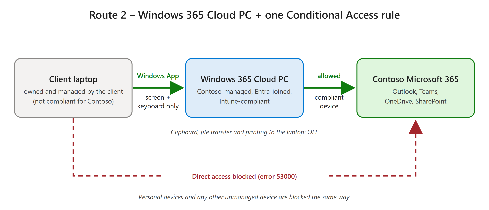
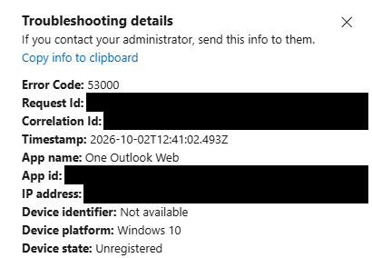
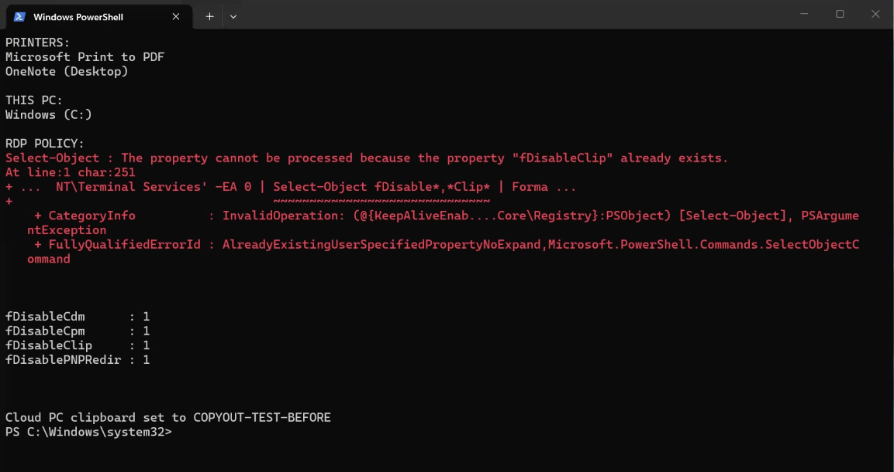
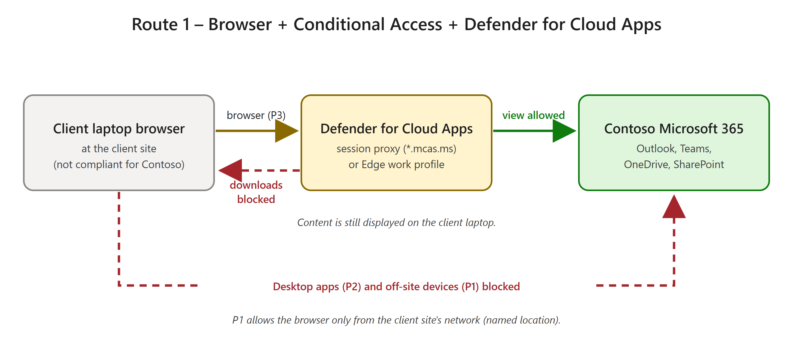

# Client-Owned Devices — Protecting Microsoft 365 Data: Playbook

A tested approach for letting staff work at client sites on **client-owned, client-managed laptops** while keeping your organization's Microsoft 365 data off those devices. Two designs were built and tested in a lab tenant; this playbook compares them and gives step-by-step deployment for both.

> Throughout this guide, **Contoso** is the organization whose data is being protected, and the **client** is the organization that owns and manages the laptops.

---

## 1. Why this matters

Contoso places staff at client sites. Those staff are given laptops that belong to — and are managed by — the client, and they need Contoso's Outlook, Teams, OneDrive and SharePoint from those laptops.

Contoso's requirements:

| ID | Requirement |
|---|---|
| R1 | Block Contoso Microsoft 365 access from unmanaged and personal devices. |
| R2 | Let workers do their job at client sites on the client-provided laptop. |
| R3 | Keep Contoso data from being stored on the client laptop (downloads, copy/paste, file transfer, printing). |
| R4 | Give workers and the service desk a usable, supportable experience. |
| R5 | Use services Contoso can license and operate: Microsoft Entra ID, Intune, Windows 365, Defender. |

---

## 2. Why the obvious approaches don't work

| Approach | Why it fails | Lab evidence |
|---|---|---|
| Register or enroll the client laptop in Contoso's tenant | A Windows device can be managed by only one organization. The client already manages the laptop. | Windows refused to add the second organization's work account ("already being managed by an organization"); no device object was created. |
| Intune app protection (MAM) for Windows | Requires a device that isn't joined to or enrolled in any organization. | Product requirement. |
| Browser session control only (Defender for Cloud Apps) | Without a Contoso Edge work profile, sessions fall back to a reverse proxy: the address changes to `*.mcas.ms` and a "monitored" notice appears. | Reproduced on demand (image below). |

*On an unmanaged laptop without a work profile, browser session control routes OneDrive through the Defender for Cloud Apps proxy and shows a "monitored" notice.*

---

## 3. The two routes

| | Route 1: Browser + Defender for Cloud Apps | Route 2: Windows 365 Cloud PC |
|---|---|---|
| **How it works** | Workers use the client laptop's browser. Conditional Access sends sessions through Defender for Cloud Apps, which blocks downloads. | Workers use a Contoso-managed Cloud PC through the Windows App. The laptop only shows the screen. |
| **Where Contoso data lives** | Displayed on the client laptop | Stays in the Cloud PC |
| **Components** | Conditional Access P1, P2, P3; a client-site named location; a Defender for Cloud Apps session policy | One Conditional Access rule; Windows 365 Cloud PCs; an Intune lockdown policy |
| **Blocks unmanaged and personal devices** | Yes — P1 and P2 | Yes |
| **Stops data reaching the laptop** | Partly — downloads blocked; content still displayed; download control is a deterrent, not a hard boundary | Yes — clipboard, file transfer and printing blocked |
| **Worker experience** | Profile prompt, monitoring notice, proxy address | A normal Windows desktop |
| **Depends on** | The client allowing a Contoso Edge work profile on its laptops | The client network allowing Windows 365 traffic |
| **Extra licensing** | Defender for Cloud Apps (Microsoft 365 E5, E5 Security or add-on) | Windows 365 Enterprise per worker (requires Windows Enterprise, Intune and Entra ID P1 — which also covers Conditional Access) |

### Recommendation and design rules

- **Lead with Route 2** for client-site workers.
- **Use Route 1 only as a fallback** for workers who can't be given a Cloud PC. Consider SharePoint/Exchange **web-only access** instead of Defender for Cloud Apps: view in the browser, no downloads, no proxy, no extra licence.
- **The routes are alternatives, not layers.** Put each worker in exactly one route's group. Route 2's rule blocks the browser access Route 1 allows, and Route 1's P1 has no Windows 365 exclusions, so it would block the Cloud PC connection.
- **Protect administrators.** Exclude a break-glass account from every Conditional Access policy, and test blocking rules with a dedicated test user — never your only administrator.

---

## 4. Route 2 — Windows 365 Cloud PC + Conditional Access (recommended)

### How it works

The worker opens the Windows App (`windows.cloud.microsoft` or the installed app) on the client laptop and connects to a Contoso Cloud PC. The Cloud PC is Microsoft Entra joined and Intune-compliant, so it passes the Conditional Access rule. Any direct attempt to reach Contoso Microsoft 365 from the laptop is blocked — except the connection to the Cloud PC itself. Clipboard, drive and printer redirection are off, so data stays in the Cloud PC.

| From | To | Result |
|---|---|---|
| Client laptop | Outlook, Teams, OneDrive, SharePoint (directly) | **Blocked** — the device is not compliant |
| Client laptop | Windows App → Cloud PC | **Allowed** — the connection apps are excluded from the rule |
| Cloud PC | Outlook, Teams, OneDrive, SharePoint | **Allowed** — the Cloud PC is compliant |

### Components

| Component | Configuration |
|---|---|
| Licence | Windows 365 Enterprise — one per worker |
| Worker group | e.g. `W365 Cloud PC Users` — receives the Cloud PC, the lockdown policy and the access rule |
| Provisioning policy | Microsoft Entra join; Microsoft-hosted network; Windows 11 Enterprise + Microsoft 365 Apps gallery image; single sign-on on |
| Conditional Access rule | `Managed devices only - Cloud PC connection allowed` — Users: worker group (exclude break-glass and guests); Resources: All, excluding **Windows 365**, **Azure Virtual Desktop**, **Windows Cloud Login**; Grant: compliant device **or** Microsoft Entra hybrid joined device |
| Intune policy | `W365 - Block copy-out routes` — Do not allow Clipboard redirection, Do not allow drive redirection, Do not allow client printer redirection = **Enabled** |
| Break-glass account | Cloud-only Global Administrator, excluded from every Conditional Access policy |

### Lab results

The rule was enforced for a test account while all other policies stayed in report-only.

| Test | Expected | Result |
|---|---|---|
| A. Laptop opens Outlook on the web directly | Blocked | **Blocked** — error 53000, device state "Unregistered" |
| A2. Laptop opens OneDrive / SharePoint directly | Blocked | **Blocked** — error 53000 |
| B. Laptop connects to the Cloud PC | Allowed | **Connected** |
| C. Outlook inside the Cloud PC | Allowed | **Opened normally** |
| D. `windows365.microsoft.com` from the laptop | Allowed | **Works** — redirects to the Windows App |
| E. Clipboard, drive and printer redirection | Blocked | **Already off** by Windows 365 default; now enforced by Intune |

The Entra sign-in logs recorded the rule as **failure** for every direct sign-in from the laptop and **success** for sign-ins from the Cloud PC.

*Test A — the unmanaged laptop is blocked from Outlook on the web (error 53000, device state Unregistered). Identifiers redacted.*

*Inside the Cloud PC before any change: clipboard (`fDisableClip`), drive (`fDisableCdm`), printer (`fDisableCpm`) and plug-and-play redirection are already `1` (blocked), and no laptop printers or drives are redirected. The red text is a harmless formatting error in the query.*

### Notes and limitations

- The **Windows 365 Portal** app can't be targeted by Conditional Access (`UnsupportedFirstPartyApplication`). It didn't need an exclusion — the portal redirects to the Windows App, which worked.
- **Screen photography is still possible.** Windows 365 screen capture protection and watermarking are optional additions.
- **Redirection defaults:** Windows 365 disables clipboard, drive, USB and printer redirection by default. The Windows App "In Session Settings" dialog shows only the local device's preferences — not what the Cloud PC allows.
- **Network:** client sites must allow Windows 365 traffic.

---

## 5. Route 1 — Browser + Conditional Access + Defender for Cloud Apps (fallback)

### How it works

Workers use the browser on the client laptop. **P1** requires a managed device everywhere except the client site's network. **P2** blocks desktop and mobile apps on unmanaged devices. **P3** sends browser sessions to Defender for Cloud Apps, where a session policy blocks file downloads to devices that aren't compliant or hybrid-joined.

### Components

| Component | Configuration |
|---|---|
| P1 — Require compliant or hybrid device — client site excluded | All client apps; grant compliant **or** hybrid joined; client-site named location excluded |
| P2 — Desktop and mobile clients require compliant device | Client apps: mobile apps and desktop clients; grant compliant **or** hybrid joined |
| P3 — Browser session control — custom policy | Client apps: browser; session: Conditional Access App Control → **Use custom policy** |
| Named location | `Client Site` — the client site's public IP ranges |
| Session policy | `Block download on unmanaged devices` — Control file download (with inspection); Device tag **does not equal** Intune compliant / Microsoft Entra hybrid joined; action **Block** |
| Scope | All three policies target the worker group and exclude break-glass and guests |

### Lab results — P3 + session policy (enforced for a test account)

| Step | What happened |
|---|---|
| 1. Laptop opens OneDrive | "Access to Microsoft OneDrive for Business is monitored" notice |
| 2. Profile choice | Offered **Switch to work profile** or **Continue with current profile** |
| 3. Continue with current profile | OneDrive opened through the proxy address (`…sharepoint.com.mcas.ms`) |
| 4. Download a Word document (twice) | Both downloads were replaced by a block-notice file (`Blocked_<timestamp>.txt`); the activity log shows "Download file" with the block icon |
| 5. Same policy on a compliant device with an Edge work profile (the Cloud PC) | No proxy — OneDrive stayed on its native address |

*Defender for Cloud Apps asks the worker to switch to a work profile or continue with the current profile. Account name redacted.*

*Defender for Cloud Apps activity log — the "Download file" entry carries the block icon. IP addresses redacted.*

### Lab results — P1 and P2 (report-only, from the Entra sign-in logs)

| Device | Access type | P1 | P2 | P3 |
|---|---|---|---|---|
| Laptop (unregistered) | Browser (Outlook, SharePoint) | Would block | Not applicable | Session control |
| Laptop (unregistered) | Desktop apps (Azure CLI, Microsoft Graph tools, Edge sign-in) | Would block | Would block | Not applicable |
| Cloud PC (compliant) | Browser and desktop apps | Allowed | Allowed | Session control (browser) |

*In the lab the laptop was outside the client-site named location, so P1 would block it. At a real client site, with the real IP ranges configured, P1 would allow the browser and P3 would apply session control.*

### Limitations

- Contoso data is still **displayed on the client laptop**; only downloads are controlled.
- Download control stops normal user downloads but is **not a hard data boundary** — in the lab, a scripted request made inside the session still returned the file. Treat it as a deterrent and pair it with sensitivity labels and auditing.
- Workers see a **profile prompt, a monitoring notice and a proxy address** unless the client allows a Contoso Edge work profile.
- **Report-only can't test session controls** — P3 must be piloted enforced for a test group.
- P1 has no Windows 365 exclusions — keep Route 1 and Route 2 workers in **separate groups**.

> **Lighter alternative (not tested in the lab):** SharePoint and Exchange **web-only access** (Conditional Access app-enforced restrictions). Users can view files in the browser but can't download, print or sync them — no proxy page and no Defender for Cloud Apps licence.

---

## 6. Deployment — Route 2 (recommended)

### Prerequisites

- **Licences:** Windows 365 Enterprise per worker, plus Windows Enterprise E3, Microsoft Intune and Microsoft Entra ID P1 per worker (all included in Microsoft 365 E3/E5).
- **Roles:** Global Administrator, or Windows 365 Administrator + Intune Administrator + Conditional Access Administrator.
- **Test user:** a dedicated, non-administrator account with its own Windows 365 licence.
- **Network:** confirmation that client sites allow Windows 365 traffic.

### Step 1 — Create a break-glass account

1. Entra admin center → **Users** → **New user**: a cloud-only account.
2. Assign the **Global Administrator** role.
3. Protect it with a strong credential kept in a vault — preferably a FIDO2 security key.
4. Exclude it from **every** Conditional Access policy, existing and new.
5. Alert on any sign-in by this account, and test it periodically.

### Step 2 — Create the worker group

Entra admin center → **Groups** → **New group** → Security, e.g. `W365 Cloud PC Users`. Add only the test user for now.

### Step 3 — Assign Windows 365 licences

Microsoft 365 admin center → **Billing** → **Licenses** → Windows 365 Enterprise → assign to the group (group-based licensing) or per user. Make sure every user has a usage location.

### Step 4 — Create the provisioning policy

Intune admin center → **Devices** → **Windows 365** → **Provisioning policies** → **Create policy**:

| Setting | Value |
|---|---|
| Join type | Microsoft Entra join |
| Network | Microsoft hosted network; region closest to the workers |
| Single sign-on | On |
| Image | Gallery image — Windows 11 Enterprise + Microsoft 365 Apps |
| Assignments | The worker group |

Provisioning takes 30–60 minutes; check **Devices → Windows 365 → All Cloud PCs** for status *Provisioned*. Policy names can't contain `( ) & | $ ' " , ; ^ < >`.

### Step 5 — Confirm the Cloud PC is compliant

Intune admin center → **Devices** → **All devices** → the Cloud PC → Compliance must show *Compliant*. If you use compliance policies, make sure Cloud PCs meet them — the access rule depends on it.

### Step 6 — Block the copy-out routes

Intune admin center → **Devices** → **Configuration** → **Create** → **New policy** → Windows 10 and later → **Settings catalog**. In the settings picker, search for and add:

| Setting | Value |
|---|---|
| Do not allow Clipboard redirection | Enabled |
| Do not allow drive redirection (blocks file transfer) | Enabled |
| Do not allow client printer redirection | Enabled |
| *Optional:* Do not allow supported Plug and Play device redirection | Enabled |

Assign to the worker group. Optionally add Windows 365 screen capture protection and watermarking. Verify: **Devices** → the Cloud PC → **Device configuration** → the policy shows *Succeeded*.

### Step 7 — Create the Conditional Access rule (report-only)

Entra admin center → **Protection** → **Conditional Access** → **Policies** → **New policy**:

| Setting | Value |
|---|---|
| Name | `Managed devices only - Cloud PC connection allowed` |
| Users — include | The worker group |
| Users — exclude | The break-glass account; Guest or external users (all types) |
| Target resources — include | All resources |
| Target resources — exclude | **Windows 365**, **Azure Virtual Desktop**, **Windows Cloud Login** (and Microsoft Remote Desktop if it's listed in your tenant) |
| Grant | Require device to be marked as compliant; Require Microsoft Entra hybrid joined device; **Require one of the selected controls** |
| Enable policy | **Report-only** |

### Step 8 — Validate in report-only (no user impact)

1. Have the test user sign in from an unmanaged device and from the Cloud PC.
2. Entra admin center → **Monitoring** → **Sign-in logs** → open each sign-in → **Report-only** tab.
3. Expect *Report-only: Failure* from the unmanaged device, *Report-only: Success* from the Cloud PC, and *Not applied* for the Windows App connection.
4. Optionally confirm with the Conditional Access **What If** tool.

### Step 9 — Pilot with enforcement

With only the test user in the group, set the policy to **On** and run:

| Test | Expected result |
|---|---|
| A. Unmanaged device → Outlook on the web | Blocked, error 53000 |
| B. Unmanaged device → Windows App → Cloud PC | Connects |
| C. Cloud PC → Outlook, Teams, OneDrive | Normal access |
| D. Copy text in the Cloud PC, paste on the local device | Nothing is pasted; no local drives or printers appear in the Cloud PC |

> **Rollback:** set the policy back to Report-only or Off, or remove the user from the group. If administrators are locked out, sign in with the break-glass account and do the same.

### Step 10 — Roll out

- Add workers to the group in waves.
- Tell workers how to connect: `windows.cloud.microsoft` or the Windows App — Contoso apps are used inside the Cloud PC.
- Brief the service desk: error 53000 on a client laptop is expected — the answer is to use the Cloud PC.

### Step 11 — Operate

- Review sign-in logs and Conditional Access failures regularly.
- Monitor Cloud PC health and usage in Intune; manage licences as workers join and leave.
- Alert on, and periodically test, the break-glass account.

---

## 7. Deployment — Route 1 (fallback)

### Prerequisites

- Defender for Cloud Apps licence (Microsoft 365 E5, E5 Security or add-on) and Microsoft Entra ID P1.
- The client's agreement to let workers add a Contoso work profile in Microsoft Edge (for the best experience).
- The client site's public IP ranges.
- A worker group that is **separate** from the Route 2 group, e.g. `Client-Site Workers`.

### Step 1 — Break-glass account and group

As Route 2, Steps 1–2. Add only the test user to the group.

### Step 2 — Named location for the client site

Entra admin center → **Conditional Access** → **Named locations** → **IP ranges location** `Client Site` with the client's public IP ranges. Don't enable P1 until these ranges are correct.

### Step 3 — Create P1, P2 and P3 in report-only

For each policy: Users = the worker group, excluding the break-glass account and guest or external users; Target resources = All resources; Enable policy = **Report-only**.

| Policy | Conditions | Grant / Session |
|---|---|---|
| P1 — Require compliant or hybrid device — client site excluded | Network / Locations: include any location, exclude `Client Site` | Grant: compliant **or** hybrid joined (require one) |
| P2 — Desktop and mobile clients require compliant device | Client apps: Mobile apps and desktop clients | Grant: compliant **or** hybrid joined (require one) |
| P3 — Browser session control — custom policy | Client apps: Browser | Session: Use Conditional Access App Control → **Use custom policy** |

### Step 4 — Create the session policy

Defender portal → **Cloud apps** → **Policies** → **Policy management** → **Conditional access** tab → **Create policy** → **Session policy**:

| Setting | Value |
|---|---|
| Name | `Block download on unmanaged devices` |
| Session control type | Control file download (with inspection) |
| Activity filter | Device → Tag → **does not equal** → Intune compliant, Microsoft Entra hybrid joined |
| Action | **Block** (optionally customise the block message) |

Author session policies in the Defender portal. A Conditional Access policy set to *Monitor only* or *Block downloads* in Entra doesn't use these custom policies.

### Step 5 — Validate P1 and P2 in report-only

Use the sign-in log **Report-only** tab as in Route 2, Step 8. Expect *would block* for desktop apps on an unmanaged device and for browser access from outside the client site.

### Step 6 — Pilot P3 + session policy

Set P3 to **On** for the test user only — session control can't block sign-in. From an unmanaged laptop: open OneDrive → expect the monitoring notice or profile prompt → download a file → expect a block-notice file, and a **Download file** entry with the block icon in **Defender → Cloud apps → Activity log**.

### Step 7 — Pilot P1 and P2, then roll out

Enable P1 and P2 for the test user; confirm desktop apps are blocked and browser access works only from the client site. Then add workers in waves and brief them on the Edge work profile prompt.

### Alternative — web-only access without Defender for Cloud Apps

*Not tested in the lab.* Instead of P3 and the session policy:

- SharePoint admin center → **Policies** → **Access control** → **Unmanaged devices** → *Allow limited, web-only access*.
- Exchange Online: set the Outlook on the web mailbox policy's `ConditionalAccessPolicy` to `ReadOnly` (or `ReadOnlyPlusAttachmentsBlocked`), and target Exchange Online with a Conditional Access policy that uses app-enforced restrictions.

---

## 8. Lessons learned

- **Test blocking rules with a dedicated test user.** Testing with the only administrator locked that account out for about 35 minutes; the break-glass account restored access.
- **Plan rollback through the break-glass account.** An administrator's own long-lived sign-in is not a reliable way to undo a rule that blocks that administrator.
- **Windows 365 blocks clipboard, drive, USB and printer redirection by default.** Pin it with an Intune policy so it's visible and reportable.
- **Report-only shows grant results but can't test session controls.** Defender for Cloud Apps needs an enforced pilot.
- **Some Windows 365 apps can't be targeted by Conditional Access.** Test the full connection path in report-only before enforcing.
- **Keep Route 1 and Route 2 workers in separate groups.**
- **Revert temporary test changes immediately and verify.** In the lab, one test policy stayed enforced for several hours after a test.

---

## 9. References

- [Set Conditional Access policies for Windows 365](https://learn.microsoft.com/en-us/windows-365/enterprise/set-conditional-access-policies)
- [Manage device RDP redirections for Cloud PCs](https://learn.microsoft.com/en-us/windows-365/enterprise/manage-rdp-device-redirections)
- [Create session policies — Microsoft Defender for Cloud Apps](https://learn.microsoft.com/en-us/defender-cloud-apps/session-policy-aad)
- [Control access from unmanaged devices — SharePoint](https://learn.microsoft.com/en-us/sharepoint/control-access-from-unmanaged-devices)

---

**Developer**: Dr Muataz Awad
