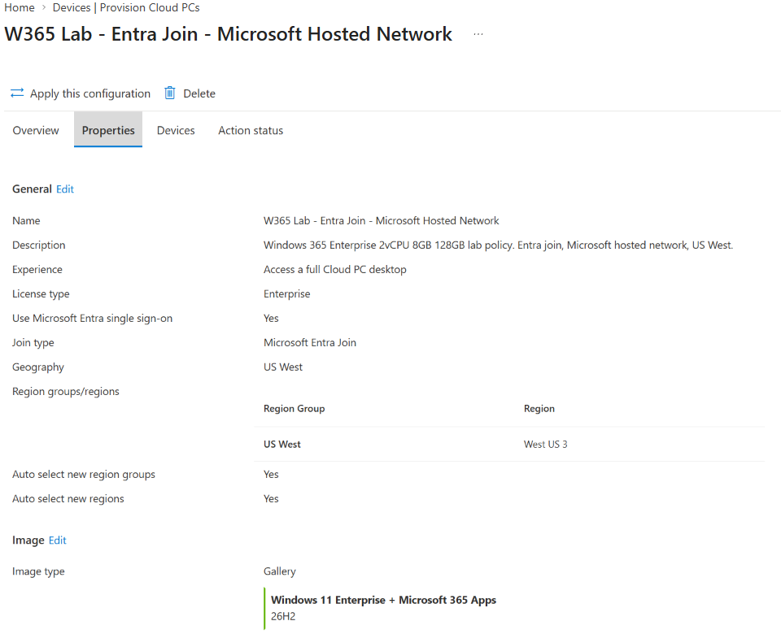
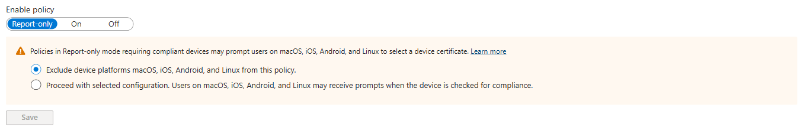

# Protecting Microsoft 365 data on client-owned devices

[](https://learn.microsoft.com/en-us/windows-365/enterprise/set-conditional-access-policies)
[](https://learn.microsoft.com/en-us/windows-365/enterprise/set-conditional-access-policies)
[](https://learn.microsoft.com/en-us/windows-365/enterprise/manage-rdp-device-redirections)
[](https://learn.microsoft.com/en-us/defender-cloud-apps/session-policy-aad)

Staff who work at client sites often use laptops that the **client** owns and manages. They need your Microsoft 365, but you can't manage those laptops. This guide shows two tested ways to keep your data off them:

- **Route 2 — Windows 365 Cloud PC + one Conditional Access rule (recommended).** Workers use a Cloud PC that you manage. The client laptop only shows the screen, and direct access from it is blocked.
- **Route 1 — Browser + Defender for Cloud Apps (fallback).** Workers use the client laptop's browser, and Defender for Cloud Apps blocks downloads.

<table>
<tr><th width="50%">Route 2: Windows 365 Cloud PC (recommended)</th><th width="50%">Route 1: Browser + Defender for Cloud Apps</th></tr>
<tr>
<td valign="top">Data stays in the Cloud PC. Workers get a normal Windows desktop. One Conditional Access rule and one Intune policy. See the <a href="#deploy-route-2-recommended">steps</a>.</td>
<td valign="top">Data is displayed on the client laptop; downloads are blocked. Workers see a proxy page or a work-profile prompt. See the <a href="#deploy-route-1-fallback">steps</a>.</td>
</tr>
<tr>
<td align="center"></td>
<td align="center"></td>
</tr>
</table>

> [!IMPORTANT]
> Community guidance, provided as-is. It isn't an official Microsoft product or recommendation. Everything here was tested in a lab tenant — test in your own environment, in report-only and with a dedicated test user, before you enforce anything.

## Contents

- [Why](#why)
- [What it looks like](#what-it-looks-like)
- [The two routes](#the-two-routes)
- [Prerequisites](#prerequisites)
- [Deploy Route 2 (recommended)](#deploy-route-2-recommended)
- [Check that it works](#check-that-it-works)
- [Deploy Route 1 (fallback)](#deploy-route-1-fallback)
- [Lab results](#lab-results)
- [Good to know](#good-to-know)
- [Troubleshooting](#troubleshooting)
- [Roll back](#roll-back)
- [Repository layout](#repository-layout)

## Why

Contoso places staff at client sites. Those staff use laptops that belong to — and are managed by — the client, and they need Contoso's Outlook, Teams, OneDrive and SharePoint. Contoso must keep its data off devices it doesn't manage, and keep personal devices out.

The obvious fixes don't work:

| Approach | Why it fails |
|---|---|
| Register or enroll the client laptop in Contoso's tenant | A Windows device can be managed by only one organization, and the client already manages it. Windows refuses to add the second organization's work account. |
| Intune app protection (MAM) for Windows | Requires a device that isn't joined to or enrolled in any organization. |
| Browser session control alone (Defender for Cloud Apps) | Without a Contoso Edge work profile, sessions fall back to a reverse proxy: the address changes to `*.mcas.ms` and workers see a "monitored" notice. |

<p align="center"><br><sub>Browser session control on an unmanaged laptop: OneDrive is routed through the Defender for Cloud Apps proxy with a "monitored" notice.</sub></p>

## What it looks like

<table>
<tr><th width="50%">The worker connects to the Cloud PC</th><th width="50%">Direct access from the laptop is blocked</th></tr>
<tr>
<td valign="top" align="center"><br><sub>Windows App (<code>windows.cloud.microsoft</code>) lists the Cloud PC. Select it to connect.</sub></td>
<td valign="top" align="center"><br><sub>Outlook on the web from the client laptop: error 53000, device state <i>Unregistered</i>. Identifiers redacted.</sub></td>
</tr>
</table>

Inside the Cloud PC, Outlook, Teams, OneDrive and SharePoint work normally, because the Cloud PC is a compliant, Contoso-managed device. Clipboard, file transfer and printing to the laptop are off, so data stays in the Cloud PC.

## The two routes

| | Route 1: Browser + Defender for Cloud Apps | Route 2: Windows 365 Cloud PC |
|---|---|---|
| **How it works** | Conditional Access sends browser sessions through Defender for Cloud Apps, which blocks downloads | Workers use a Contoso-managed Cloud PC through the Windows App |
| **Where Contoso data lives** | Displayed on the client laptop | Stays in the Cloud PC |
| **Blocks unmanaged and personal devices** | Yes — P1 and P2 | Yes — one rule |
| **Stops data reaching the laptop** | Partly — downloads blocked; content still displayed | Yes — clipboard, file transfer and printing blocked |
| **Worker experience** | Profile prompt, monitoring notice, proxy address | A normal Windows desktop |
| **Depends on** | The client allowing a Contoso Edge work profile | The client network allowing Windows 365 traffic |
| **Extra licensing** | Defender for Cloud Apps (Microsoft 365 E5, E5 Security or add-on) | Windows 365 Enterprise per worker |

**Recommendation:** lead with Route 2. Use Route 1 — or the lighter SharePoint/Exchange [web-only access](#alternative-web-only-access-without-defender-for-cloud-apps) — only for workers who can't be given a Cloud PC. The routes are alternatives, not layers: put each worker in exactly one route's group.

## Prerequisites

- **Licences:** Windows 365 Enterprise per worker, plus Windows Enterprise E3, Microsoft Intune and Microsoft Entra ID P1 (all included in Microsoft 365 E3/E5). Entra ID P1 also covers Conditional Access.
- **Roles:** Global Administrator, or Windows 365 Administrator + Intune Administrator + Conditional Access Administrator.
- **Test user:** a dedicated, non-administrator account with its own Windows 365 licence. Don't test blocking rules with your only administrator.
- **Network:** confirmation that client sites allow Windows 365 traffic.

## Deploy Route 2 (recommended)

### Step 1 — Create a break-glass account

1. Entra admin center → **Users** → **New user**: a cloud-only account.
2. Assign the **Global Administrator** role.
3. Protect it with a strong credential kept in a vault — preferably a FIDO2 security key.
4. Exclude it from **every** Conditional Access policy, existing and new.
5. Alert on any sign-in by this account, and test it periodically.

### Step 2 — Create the worker group and assign licences

1. Entra admin center → **Groups** → **New group** → Security, for example `W365 Cloud PC Users`. Add only the test user for now.
2. Microsoft 365 admin center → **Billing** → **Licenses** → **Windows 365 Enterprise** → assign to the group (group-based licensing) or per user. Make sure every user has a usage location.

### Step 3 — Create the provisioning policy

Intune admin center → **Devices** → **Windows 365** → **Provision Cloud PCs** → **Provisioning policies** → **Create policy**:

| Setting | Value |
|---|---|
| Join type | Microsoft Entra join |
| Network | Microsoft hosted network; region closest to the workers |
| Use Microsoft Entra single sign-on | Yes |
| Image | Gallery image — Windows 11 Enterprise + Microsoft 365 Apps |
| Assignments | The worker group |

<p align="center"><br><sub>The finished provisioning policy: Entra join, single sign-on, Windows 11 Enterprise + Microsoft 365 Apps.</sub></p>

Provisioning takes 30–60 minutes. Check **Devices → Windows 365 → All Cloud PCs** for status *Provisioned*. Policy names can't contain `( ) & | $ ' " , ; ^ < >`.

### Step 4 — Confirm the Cloud PC is compliant

Intune admin center → **Devices** → **All devices** → the Cloud PC → **Compliance** must show *Compliant*. If you use compliance policies, make sure Cloud PCs meet them — the access rule depends on it.

### Step 5 — Block the copy-out routes

Windows 365 already turns off clipboard, drive, USB and printer redirection by default. Pin it with a policy so it's explicit and reportable.

Intune admin center → **Devices** → **Configuration** → **Create** → **New policy** → **Windows 10 and later** → **Settings catalog**. In the settings picker, search for and add:

| Setting | Value |
|---|---|
| Do not allow client printer redirection | Enabled |
| Do not allow Clipboard redirection | Enabled |
| Do not allow drive redirection (blocks file transfer) | Enabled |
| *Optional:* Do not allow supported Plug and Play device redirection | Enabled |

Assign it to the worker group.

<p align="center"><br><sub>The three redirection settings, all <b>Enabled</b>.</sub></p>

<p align="center"><br><sub>After the Cloud PC syncs, the policy shows <b>Succeeded</b>.</sub></p>

<p align="center"><br><sub>Inside the Cloud PC: clipboard (<code>fDisableClip</code>), drive (<code>fDisableCdm</code>), printer (<code>fDisableCpm</code>) and plug-and-play redirection are <code>1</code> (blocked), and no laptop drives or printers appear. The red text is a harmless formatting error in the query.</sub></p>

### Step 6 — Create the Conditional Access rule (report-only)

Entra admin center → **Entra ID** → **Conditional Access** → **Policies** → **New policy**:

| Setting | Value |
|---|---|
| Name | `Managed devices only - Cloud PC connection allowed` |
| Users — include | The worker group |
| Users — exclude | The break-glass account; Guest or external users (all types) |
| Target resources — include | All resources |
| Target resources — exclude | **Windows 365**, **Azure Virtual Desktop**, **Windows Cloud Login** (and Microsoft Remote Desktop if it's listed in your tenant) |
| Grant | Require device to be marked as compliant; Require Microsoft Entra hybrid joined device; **Require one of the selected controls** |
| Enable policy | **Report-only** |

<table>
<tr><th width="62%">Target resources: all, minus the three Cloud PC connection apps</th><th width="38%">Grant: compliant or hybrid joined</th></tr>
<tr>
<td valign="top" align="center"></td>
<td valign="top" align="center"></td>
</tr>
</table>

<p align="center"><br><sub>Start in <b>Report-only</b>. The Cloud PC connection apps are excluded so workers can still reach their Cloud PC from the client laptop.</sub></p>

### Step 7 — Validate in report-only (no user impact)

1. Have the test user sign in from an unmanaged device and from the Cloud PC.
2. Entra admin center → **Monitoring** → **Sign-in logs** → open each sign-in → **Report-only** tab.
3. Expect *Report-only: Failure* from the unmanaged device, *Report-only: Success* from the Cloud PC, and *Not applied* for the Windows App connection.
4. Optionally confirm with the Conditional Access **What If** tool.

### Step 8 — Pilot with enforcement

With only the test user in the group, set the policy to **On** and run the tests in [Check that it works](#check-that-it-works).

> [!CAUTION]
> **Rollback:** set the policy back to Report-only or Off, or remove the user from the group. If administrators are locked out, sign in with the break-glass account and do the same. An administrator's own long-lived sign-in is not a reliable way to undo a rule that blocks that administrator.

### Step 9 — Roll out and operate

- Add workers to the group in waves.
- Tell workers how to connect: `windows.cloud.microsoft` or the Windows App — Contoso apps are used inside the Cloud PC.
- Brief the service desk: error 53000 on a client laptop is expected — the answer is to use the Cloud PC.
- Review sign-in logs and Conditional Access failures regularly; monitor Cloud PC health in Intune; alert on, and periodically test, the break-glass account.

## Check that it works

| Test | Expected result |
|---|---|
| A. Unmanaged device → Outlook on the web | Blocked, error 53000 |
| B. Unmanaged device → OneDrive / SharePoint | Blocked, error 53000 |
| C. Unmanaged device → Windows App → Cloud PC | Connects |
| D. Cloud PC → Outlook, Teams, OneDrive | Normal access |
| E. Copy text in the Cloud PC and paste on the local device | Nothing is pasted; no local drives or printers appear in the Cloud PC |

## Deploy Route 1 (fallback)

Use this only for workers who can't be given a Cloud PC. Keep them in a **separate** group from Route 2 — Route 1's P1 has no Windows 365 exclusions, so it would block the Cloud PC connection.

**Extra prerequisites:** a Defender for Cloud Apps licence; the client's agreement to let workers add a Contoso work profile in Microsoft Edge (for the best experience); the client site's public IP ranges.

### Step 1 — Break-glass account and group

As Route 2, Steps 1–2. Create a separate group, for example `Client-Site Workers`, and add only the test user.

### Step 2 — Named location for the client site

Entra admin center → **Conditional Access** → **Named locations** → **IP ranges location** `Client Site` with the client's public IP ranges. Don't enable P1 until these ranges are correct.

### Step 3 — Create P1, P2 and P3 in report-only

For each policy: Users = the worker group, excluding the break-glass account and guest or external users; Target resources = All resources; Enable policy = **Report-only**.

| Policy | Conditions | Grant / Session |
|---|---|---|
| P1 — Require compliant or hybrid device — client site excluded | Network: include any location, exclude `Client Site` | Grant: compliant **or** hybrid joined (require one) |
| P2 — Desktop and mobile clients require compliant device | Client apps: Mobile apps and desktop clients | Grant: compliant **or** hybrid joined (require one) |
| P3 — Browser session control — custom policy | Client apps: Browser | Session: Use Conditional Access App Control → **Use custom policy** |

### Step 4 — Create the session policy

Defender portal → **Cloud apps** → **Policies** → **Policy management** → **Conditional access** tab → **Create policy** → **Session policy**:

| Setting | Value |
|---|---|
| Name | `Block download on unmanaged devices` |
| Session control type | Control file download (with inspection) |
| Activity filter | Device → Tag → **does not equal** → Intune compliant, Microsoft Entra hybrid joined |
| Action | **Block** (optionally customise the block message) |

<p align="center"><br><sub>The session policy: control file download, applied to devices that aren't compliant or hybrid joined, action <b>Block</b>.</sub></p>

Author session policies in the Defender portal. A Conditional Access policy set to *Monitor only* or *Block downloads* in Entra doesn't use these custom policies.

### Step 5 — Validate P1 and P2 in report-only

Use the sign-in log **Report-only** tab as in Route 2, Step 7. Expect *would block* for desktop apps on an unmanaged device and for browser access from outside the client site.

### Step 6 — Pilot P3 + session policy

Set P3 to **On** for the test user only — session control can't block sign-in. From an unmanaged laptop:

1. Open OneDrive. Expect the monitoring notice, or a prompt to switch to a work profile.
2. Choose **Continue with current profile**. OneDrive opens through the proxy address (`…sharepoint.com.mcas.ms`).
3. Download a file. Expect a block-notice file (`Blocked_<timestamp>.txt`) instead of the document.
4. Defender portal → **Cloud apps** → **Activity log**: the **Download file** entry carries the block icon.

<table>
<tr><th width="45%">The worker is asked to switch profile</th><th width="55%">The blocked download in the activity log</th></tr>
<tr>
<td valign="top" align="center"><br><sub>Account name redacted.</sub></td>
<td valign="top" align="center"><br><sub>IP addresses redacted.</sub></td>
</tr>
</table>

### Step 7 — Pilot P1 and P2, then roll out

Enable P1 and P2 for the test user; confirm desktop apps are blocked and browser access works only from the client site. Then add workers in waves and brief them on the Edge work-profile prompt.

### Alternative: web-only access without Defender for Cloud Apps

*Not tested in the lab.* Instead of P3 and the session policy:

- SharePoint admin center → **Policies** → **Access control** → **Unmanaged devices** → *Allow limited, web-only access*.
- Exchange Online: set the Outlook on the web mailbox policy's `ConditionalAccessPolicy` to `ReadOnly` (or `ReadOnlyPlusAttachmentsBlocked`), and target Exchange Online with a Conditional Access policy that uses app-enforced restrictions.

Users can view files in the browser but can't download, print or sync them — no proxy page and no Defender for Cloud Apps licence.

## Lab results

**Route 2** — the rule was enforced for a test account while all other policies stayed in report-only:

| Test | Result |
|---|---|
| Laptop → Outlook on the web | **Blocked** — error 53000, device state *Unregistered* |
| Laptop → OneDrive / SharePoint | **Blocked** — error 53000 |
| Laptop → Windows App → Cloud PC | **Connected** |
| Outlook inside the Cloud PC | **Opened normally** |
| `windows365.microsoft.com` from the laptop | **Works** — redirects to the Windows App |
| Clipboard, drive and printer redirection | **Already off** by Windows 365 default; now enforced by Intune |

The Entra sign-in logs recorded the rule as **failure** for every direct sign-in from the laptop and **success** for sign-ins from the Cloud PC.

**Route 1** — P3 + session policy enforced for a test account; P1 and P2 read from the sign-in logs in report-only:

| Device | Access type | P1 | P2 | P3 |
|---|---|---|---|---|
| Laptop (unregistered) | Browser (Outlook, SharePoint) | Would block | Not applicable | Session control |
| Laptop (unregistered) | Desktop apps (Azure CLI, Microsoft Graph tools, Edge sign-in) | Would block | Would block | Not applicable |
| Cloud PC (compliant) | Browser and desktop apps | Allowed | Allowed | Session control (browser) |

Both download attempts from the unmanaged laptop were replaced by a block-notice file. On a compliant device with an Edge work profile (the Cloud PC), the same policy didn't proxy the session.

## Good to know

- **Screen photography is still possible** on both routes. Windows 365 screen capture protection and watermarking reduce, but don't remove, that risk.
- **Route 1 download control is a deterrent, not a hard data boundary.** In the lab, a scripted request made inside the session still returned the file. Pair it with sensitivity labels and auditing.
- **Report-only shows grant results but can't test session controls.** Pilot P3 enforced for a test group.
- **The Windows 365 Portal app can't be targeted by Conditional Access** (`UnsupportedFirstPartyApplication`). It doesn't need an exclusion — the portal redirects to the Windows App.
- **The Windows App "In Session Settings" dialog** shows only the local device's preferences, not what the Cloud PC allows.
- **Revert temporary test changes immediately and verify them.**

## Troubleshooting

| Symptom | Likely cause and fix |
|---|---|
| Error 53000 inside the Cloud PC | The Cloud PC isn't compliant. Check **Devices → All devices → Compliance** and any compliance policies assigned to it. |
| The worker can't connect to the Cloud PC from the laptop | One of the connection apps isn't excluded. Exclude **Windows 365**, **Azure Virtual Desktop** and **Windows Cloud Login** (and Microsoft Remote Desktop if listed). |
| `UnsupportedFirstPartyApplication` when saving the rule | You tried to exclude the Windows 365 Portal app. Remove it; it isn't needed. |
| The administrator is locked out | Sign in with the break-glass account and set the rule to Report-only or Off. |
| Route 1 sessions always go to `*.mcas.ms` | The worker isn't using a Contoso Edge work profile. That's the expected fallback. |
| Route 1 session policy never triggers | P3 must be **On** (not report-only) and set to **Use custom policy**. |

## Roll back

1. Set the Conditional Access rule (or P1–P3) to **Report-only** or **Off**.
2. Remove users from the worker group.
3. If needed, unassign or delete the Intune redirection policy (the Windows 365 defaults still apply) and the provisioning policy.

## Repository layout

```text
Client-Owned-Device-Access/
├── README.md        This page
└── docs/
    └── images/      Diagrams and redacted lab screenshots
```

Tested in a lab tenant (October 2026). Screenshots come from that tenant, with identifiers redacted; *Contoso* is a placeholder name.

## References

- [Set Conditional Access policies for Windows 365](https://learn.microsoft.com/en-us/windows-365/enterprise/set-conditional-access-policies)
- [Manage device RDP redirections for Cloud PCs](https://learn.microsoft.com/en-us/windows-365/enterprise/manage-rdp-device-redirections)
- [Create session policies — Microsoft Defender for Cloud Apps](https://learn.microsoft.com/en-us/defender-cloud-apps/session-policy-aad)
- [Control access from unmanaged devices — SharePoint](https://learn.microsoft.com/en-us/sharepoint/control-access-from-unmanaged-devices)

---

**Developer**: Dr Muataz Awad
