# Keep Microsoft 365 data off client-owned laptops

[](https://learn.microsoft.com/en-us/windows-365/enterprise/requirements)
[](https://learn.microsoft.com/en-us/windows-365/enterprise/set-conditional-access-policies)
[](https://learn.microsoft.com/en-us/windows-365/enterprise/manage-rdp-device-redirections)
[](https://learn.microsoft.com/en-us/defender-cloud-apps/session-policy-aad)

Some of your staff work at client sites on laptops that the **client** owns and manages. They still need your Microsoft 365 (Outlook, Teams, OneDrive and SharePoint), but you don't manage those laptops, so you can't trust them with your data.

This guide shows two tested ways to solve that, step by step, with screenshots:

- **Option A: Windows 365 Cloud PC (recommended).** Each worker gets a Windows PC that runs in Microsoft's cloud and that *you* manage. The client laptop only shows the Cloud PC's screen. One Conditional Access rule blocks Microsoft 365 on every other device.
- **Option B: Browser + Defender for Cloud Apps (fallback).** Workers use the client laptop's web browser, and Defender for Cloud Apps blocks downloads.

<table>
<tr><th width="50%">Option A: Windows 365 Cloud PC (recommended)</th><th width="50%">Option B: Browser + Defender for Cloud Apps</th></tr>
<tr>
<td valign="top">Your data stays inside the Cloud PC. Workers get a normal Windows desktop. You need one Conditional Access rule and one Intune policy. <a href="#option-a-step-by-step">Go to the steps</a>.</td>
<td valign="top">Your data is shown on the client laptop, but downloads are blocked. Workers see a proxy address or a prompt to add a work profile. <a href="#option-b-step-by-step">Go to the steps</a>.</td>
</tr>
<tr>
<td align="center">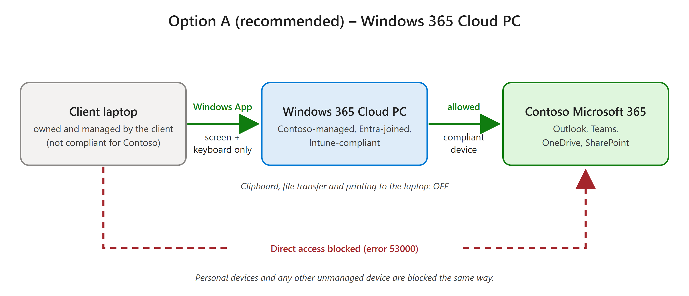</td>
<td align="center">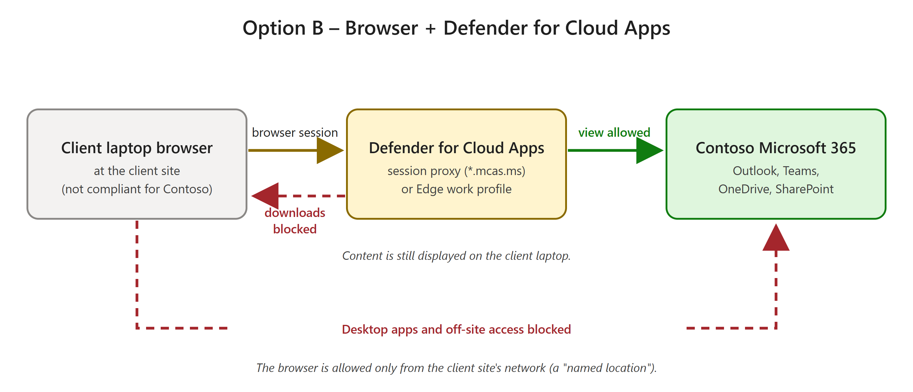</td>
</tr>
</table>

> [!IMPORTANT]
> This is community guidance, provided as-is. It isn't an official Microsoft product or recommendation. Everything here was tested in a lab tenant. Test in your own environment, in report-only mode and with a dedicated test user, before you enforce anything.

## Contents

- [The problem](#the-problem)
- [Key terms](#key-terms)
- [How Option A works](#how-option-a-works)
- [Before you start](#before-you-start)
- [Option A: step by step](#option-a-step-by-step)
  - [Part 1: Prepare the tenant](#part-1-prepare-the-tenant) (steps 1–4)
  - [Part 2: Create the Cloud PCs](#part-2-create-the-cloud-pcs) (steps 5–7)
  - [Part 3: Lock down the Cloud PCs](#part-3-lock-down-the-cloud-pcs) (step 8)
  - [Part 4: Block every other device](#part-4-block-every-other-device) (step 9)
  - [Part 5: Test and turn it on](#part-5-test-and-turn-it-on) (steps 10–12)
- [Option B: step by step](#option-b-step-by-step)
- [Lab results](#lab-results)
- [Good to know](#good-to-know)
- [Troubleshooting](#troubleshooting)
- [Roll back](#roll-back)
- [References](#references)

## The problem

Contoso (a placeholder company name) places staff at client sites. Those staff use laptops that belong to the client and are managed by the client's IT team. The staff need Contoso's Outlook, Teams, OneDrive and SharePoint. Contoso has two goals:

1. Keep Contoso data **off** devices that Contoso doesn't manage, including client laptops and personal devices.
2. Still let the staff do their jobs from the client laptop.

The obvious fixes don't work:

| Idea | Why it doesn't work |
|---|---|
| Enroll the client laptop in Contoso's Intune | A Windows device can be managed by only one organization. The client already manages it, so Windows refuses to add Contoso's work account. |
| Use Intune app protection for Windows (MAM) | It only works on devices that aren't joined to, or managed by, *any* organization. |
| Use browser session control on its own | Without a Contoso work profile in Microsoft Edge, Defender for Cloud Apps falls back to a web proxy. The web address changes to `*.mcas.ms`, and workers see a "monitored" notice. |

<p align="center">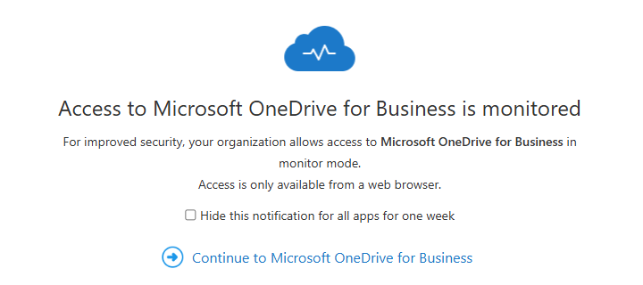<br><sub>Browser session control on an unmanaged laptop: OneDrive is routed through the Defender for Cloud Apps proxy, with a "monitored" notice.</sub></p>

## Key terms

New to these products? Here's what each term means in this guide.

| Term | What it means here |
|---|---|
| **Microsoft Entra ID** | Microsoft's cloud identity service (formerly Azure Active Directory). It's where your users sign in. You manage it in the [Microsoft Entra admin center](https://entra.microsoft.com). |
| **Conditional Access** | Rules in Entra ID that check every sign-in: who is signing in, to which app, from which device and from where. A rule can allow the sign-in, block it, or add a requirement. |
| **Microsoft Intune** | Microsoft's device management service. A device that is *enrolled* in Intune is managed by your organization. You manage it in the [Intune admin center](https://intune.microsoft.com). |
| **Compliant device** | A device that your Intune manages and that meets your Intune rules. Conditional Access can require one. A client-owned laptop can never be compliant for you, because you don't manage it. |
| **Windows 365 and Cloud PC** | Windows 365 is a service that gives each licensed user a **Cloud PC**: a full Windows 11 PC that runs in Microsoft's cloud. It's joined to your Entra ID and managed by your Intune. |
| **Windows App** | The app, or the website [windows.cloud.microsoft](https://windows.cloud.microsoft), that workers use to open their Cloud PC. Only a picture of the screen reaches the laptop. |
| **Provisioning policy** | An Intune setting that tells Windows 365 how to build Cloud PCs (Windows image, network, region) and who gets one. |
| **Redirection** | Features that connect a Cloud PC to the device in front of the worker: the clipboard (copy and paste), drives (file transfer), printers and USB devices. If you turn them off, data can't leave the Cloud PC that way. |
| **Report-only mode** | A Conditional Access setting that records what a rule *would* do, without enforcing it. Always start new rules in report-only mode. |
| **Emergency access account** | Also called a "break-glass" account. It's a spare administrator account that is left out of every Conditional Access rule, so that you can still sign in if a rule locks you out. |
| **Defender for Cloud Apps** | A Microsoft security service that can watch and control browser sessions, for example by blocking downloads. Only Option B uses it. |
| **Named location** | A list of IP addresses (for example, the client office's internet addresses) that Conditional Access can treat differently. Only Option B uses it. |

## How Option A works

1. You give each worker a **Cloud PC** that Contoso owns and manages.
2. On the client laptop, the worker opens the **Windows App** and connects to their Cloud PC.
3. Inside the Cloud PC, Outlook, Teams, OneDrive and SharePoint work normally, because the Cloud PC is a **compliant** Contoso device.
4. One **Conditional Access rule** says: "To use Contoso's Microsoft 365, you must be on a compliant device." The client laptop and personal devices fail that check, so they can't open Outlook or OneDrive directly. The rule leaves out the three apps used to *connect* to the Cloud PC, so the connection still works.
5. One **Intune policy** turns off copy and paste, file transfer and printing between the Cloud PC and the laptop, so the data stays in the Cloud PC.

<table>
<tr><th width="50%">The worker connects to the Cloud PC</th><th width="50%">Direct access from the laptop is blocked</th></tr>
<tr>
<td valign="top" align="center">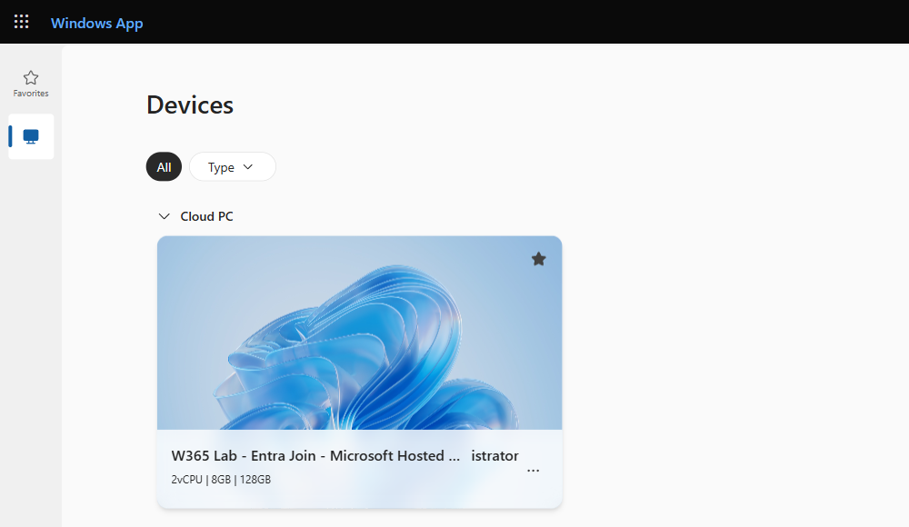<br><sub>The Windows App (<code>windows.cloud.microsoft</code>) lists the worker's Cloud PC. The worker selects it to connect.</sub></td>
<td valign="top" align="center"><br><sub>Outlook on the web, opened directly on the client laptop, is blocked with error 53000. Identifiers are redacted.</sub></td>
</tr>
</table>

## Before you start

### What you need

| Item | Details |
|---|---|
| **Licences for each worker** | **Windows 365 Enterprise**, plus **Windows 11 Enterprise E3**, **Microsoft Intune** and **Microsoft Entra ID P1**. The last three are all included in Microsoft 365 E3 or E5. Entra ID P1 also covers Conditional Access. |
| **Administrator roles** | **Global Administrator**, or this combination: **Intune Administrator** or **Windows 365 Administrator** (Cloud PCs and Intune policies), **Conditional Access Administrator** (the access rule), and **License Administrator** with **Groups Administrator** (licences and the group). |
| **Azure subscription or on-premises network** | **Not needed.** This guide uses Microsoft Entra join and the Microsoft-hosted network, so Microsoft runs the network for you. |
| **A test user** | A normal, non-administrator account with all the licences above. You'll use it to test before anyone else is affected. |
| **The client's network** | The client site must allow Windows 365 traffic. Ask the client's IT team to check the [Windows 365 network requirements](https://learn.microsoft.com/en-us/windows-365/enterprise/requirements-network). |

### Don't lock yourself out

The Conditional Access rule in this guide blocks Microsoft 365 on any device that isn't compliant. If an administrator falls inside the rule's scope while using a laptop that your Intune doesn't manage, that administrator is blocked too, including from the admin portals they'd need to undo the rule.

Two simple habits prevent that:

1. **Have an emergency access account.** It's a cloud-only account with the Global Administrator role and a strong credential, such as a FIDO2 security key or a long random password kept in a safe. Leave it out of every Conditional Access rule. Microsoft explains how in [Manage emergency access accounts](https://learn.microsoft.com/en-us/entra/identity/role-based-access-control/security-emergency-access). This account isn't part of the solution; it's your safety net.
2. **Never apply the rule to "All users".** Apply it only to the worker group, and test it with a test user while it's still in report-only mode.

## Option A: step by step

You'll use three admin portals:

| Portal | Address | What you'll do there |
|---|---|---|
| Microsoft 365 admin center | [admin.microsoft.com](https://admin.microsoft.com) | Check and assign licences |
| Microsoft Entra admin center | [entra.microsoft.com](https://entra.microsoft.com) | Create the worker group and the Conditional Access rule |
| Microsoft Intune admin center | [intune.microsoft.com](https://intune.microsoft.com) | Check enrollment, create the Cloud PCs, and turn off copy and paste |

**Time needed:** about an hour of clicking, plus 30–60 minutes while Windows 365 builds the Cloud PC.

### Part 1: Prepare the tenant

#### Step 1: Check your licences

**Why:** a Cloud PC is only built for a user who has a Windows 365 licence, and the user also needs Intune, Entra ID P1 and Windows Enterprise.

1. Go to the **Microsoft 365 admin center** → **Billing** → **Licenses**.
2. Check that **Windows 365 Enterprise** is listed and has licences available. Also check that you have Microsoft 365 E3 or E5 (or the separate Windows E3, Intune and Entra ID P1 licences).

<p align="center">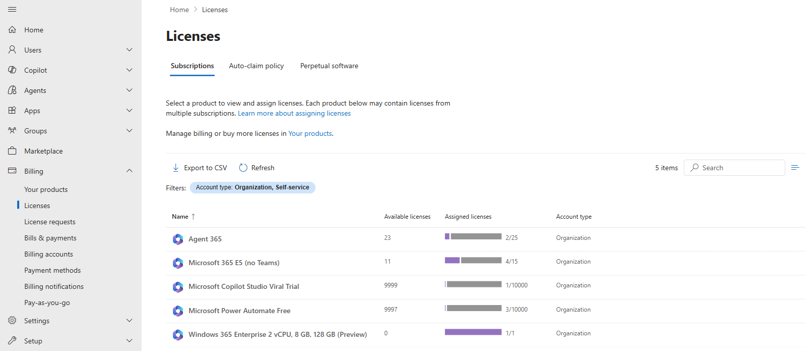<br><sub><b>Billing → Licenses.</b> The lab had Microsoft 365 E5 and one Windows 365 Enterprise licence (2 vCPU, 8 GB, 128 GB).</sub></p>

#### Step 2: Check that Intune allows Windows devices

**Why:** each Cloud PC enrolls itself into your Intune when it's built. If your tenant blocks Windows devices from enrolling, building the Cloud PC fails.

1. Go to the **Intune admin center** → **Devices** → **Enrollment** → **Windows** tab. Select **Device platform restriction**.

<p align="center">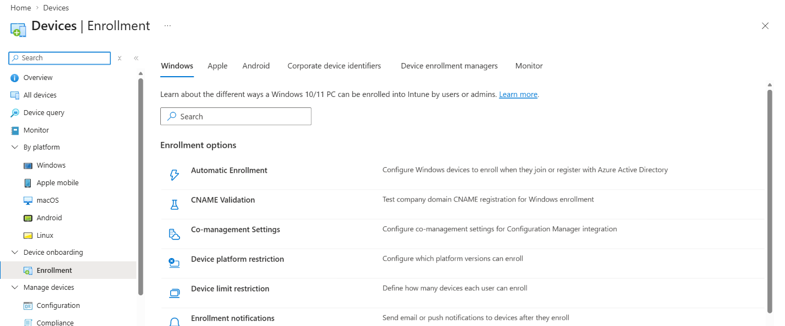<br><sub><b>Devices → Enrollment → Windows.</b> Select <b>Device platform restriction</b>.</sub></p>

2. On the **Windows restrictions** tab, select the **Default** restriction (**All Users**).

<p align="center">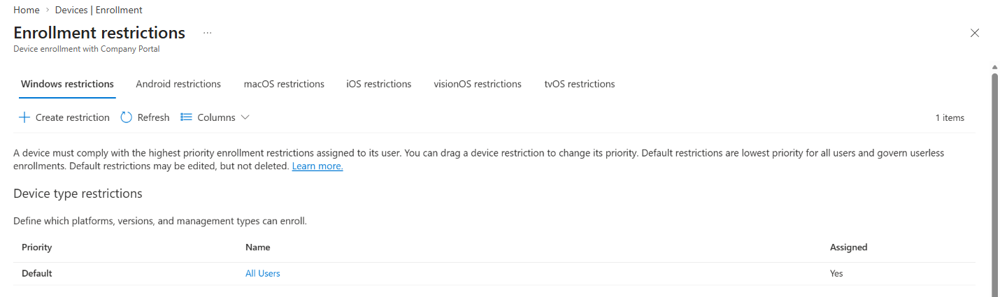<br><sub>The default restriction applies to everyone. If you've added your own restrictions, check those too.</sub></p>

3. Under **Platform settings**, check that **Windows (MDM)** is set to **Allow**. If it's set to Block, select **Edit** and change it to Allow.

<p align="center">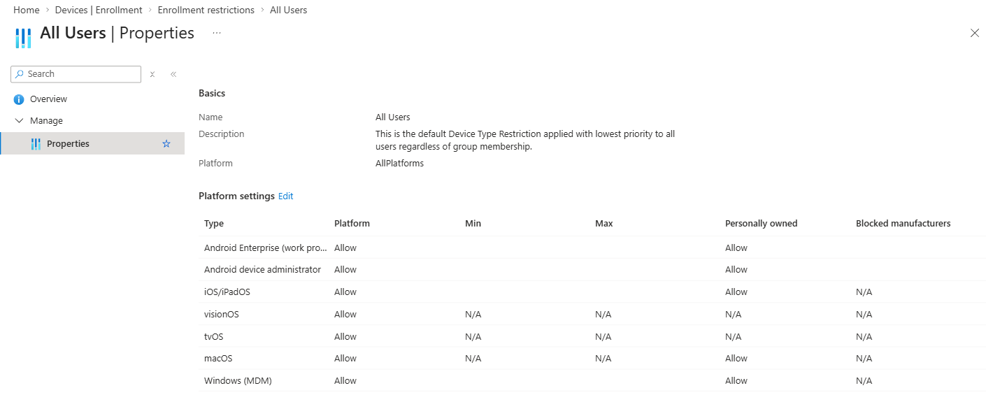<br><sub><b>Windows (MDM): Allow.</b> This is the default setting.</sub></p>

#### Step 3: Create a group for the workers

**Why:** one group drives everything. You use it to assign licences, to build Cloud PCs, to apply the lockdown policy and in the Conditional Access rule. To set up a new worker later, you just add them to the group.

1. Go to the **Entra admin center** → **Groups** → **All groups** → **New group**.
2. Fill in the form:

| Field | Value |
|---|---|
| Group type | **Security** |
| Group name | `W365 Cloud PC Users` |
| Group description | `Users who get a Windows 365 Cloud PC` |
| Membership type | **Assigned** |
| Members | Only your **test user** for now |

3. Select **Create**.

<p align="center">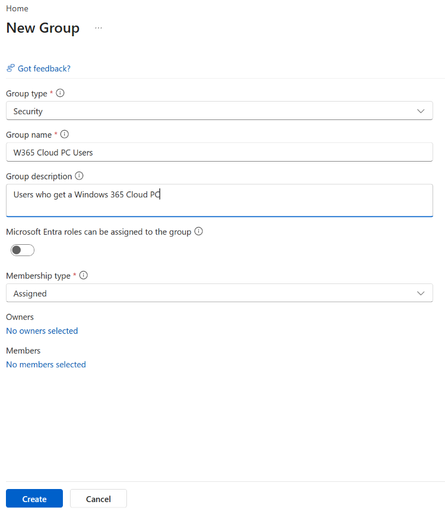<br><sub>The new security group. Add only the test user until you've finished testing.</sub></p>

#### Step 4: Give the group Windows 365 licences

1. Go to the **Microsoft 365 admin center** → **Billing** → **Licenses**, and select **Windows 365 Enterprise**.
2. Select **Assign licenses**, choose the **W365 Cloud PC Users** group, and confirm. This is called *group-based licensing*: everyone you add to the group later gets a licence automatically. You can also assign licences to individual users.
3. Make sure every worker has a **usage location** set (**Users** → select the user → **Properties**). If it's missing, the licence can't be assigned.

<p align="center">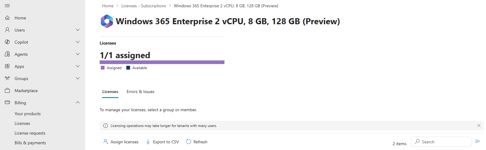<br><sub>The Windows 365 product page. Select <b>Assign licenses</b>, then choose the group.</sub></p>

### Part 2: Create the Cloud PCs

#### Step 5: Create the provisioning policy

**Why:** the provisioning policy is the recipe for the Cloud PCs. It sets how they join your tenant, which network and region they use, which Windows image they run, and which group gets one.

Go to the **Intune admin center** → **Devices** → **Provision Cloud PCs** (under *Manage Windows 365 Cloud PCs*) → **Provisioning policies** tab → **+ Create policy**. The wizard has six pages.

<p align="center">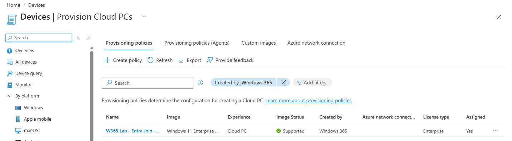<br><sub><b>Devices → Provision Cloud PCs → Provisioning policies.</b> The lab's finished policy is listed. Yours will be empty until you select <b>Create policy</b>.</sub></p>

**Page 1: General**

| Setting | Choose | Why |
|---|---|---|
| Name | `W365 - Client-site workers` | Any name will do, but it can't contain `( ) & \| $ ' " , ; ^ < >`. |
| Experience | **Access a full Cloud PC desktop** | Workers get a complete Windows desktop. |
| License type | **Enterprise** | It matches the Windows 365 Enterprise licence. |
| Join type | **Microsoft Entra Join** | No on-premises Active Directory is needed. |
| Network | **Microsoft hosted network** | Microsoft runs the network, so you don't need an Azure subscription. |
| Geography and region | The geography **closest to the workers** | Shorter distance means less lag. |
| Use Microsoft Entra single sign-on | **Ticked** | Workers sign in once, not twice. |

<p align="center">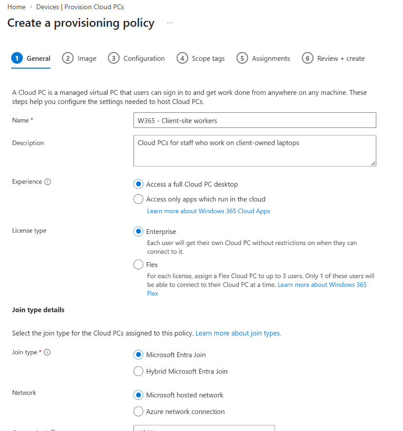<br><sub><b>General</b> (top half): name, description, full desktop, Enterprise, Microsoft Entra Join and the Microsoft-hosted network.</sub></p>

<p align="center">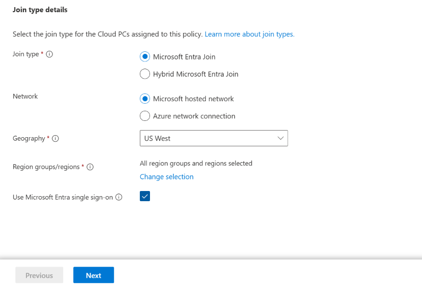<br><sub><b>General</b> (bottom half): geography, regions and <b>Use Microsoft Entra single sign-on</b>. Select <b>Next</b>.</sub></p>

**Page 2: Image.** Choose **Gallery image**, then **Windows 11 Enterprise + Microsoft 365 Apps** (the newest version). It already includes Outlook, Teams, Word, Excel and the other Microsoft 365 apps.

<p align="center">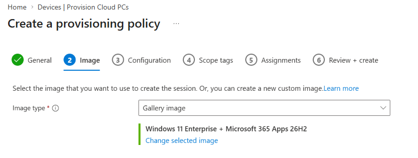<br><sub><b>Image:</b> a Microsoft gallery image with Microsoft 365 Apps already installed.</sub></p>

**Page 3: Configuration.** Choose the workers' **language and region**. A device name template is optional. Leave *Autopilot device preparation policy* set to **None**. Under *Additional services*, choose **Windows Autopatch** if you want Microsoft to keep the Cloud PCs updated, or **None** if you manage updates another way.

<p align="center">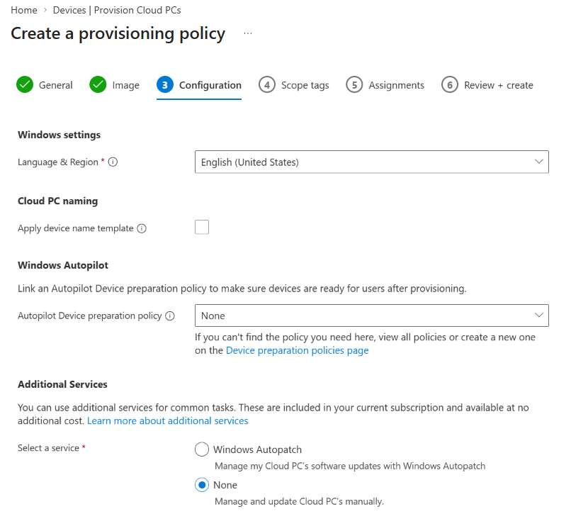<br><sub><b>Configuration:</b> the lab used English (United States), no naming template and no additional services.</sub></p>

**Page 4: Scope tags.** Leave the default and select **Next**.

**Page 5: Assignments.** Select **Add groups**, then choose **W365 Cloud PC Users**.

<p align="center">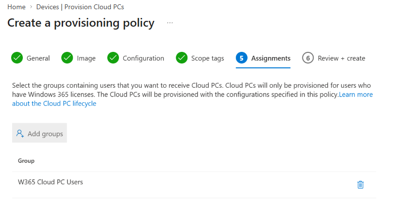<br><sub><b>Assignments:</b> every licensed member of this group gets a Cloud PC.</sub></p>

**Page 6: Review + create.** Check the summary, then select **Create**.

<p align="center">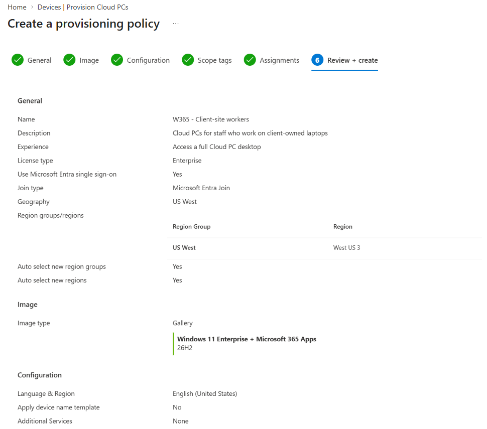<br><sub><b>Review + create.</b> Windows 365 starts building a Cloud PC for each licensed member of the group.</sub></p>

#### Step 6: Wait for the Cloud PC to be built

Go to the **Intune admin center** → **Devices** → **All Cloud PCs** (under *Manage Windows 365 Cloud PCs*). The status changes from **Provisioning** to **Provisioned**, usually within 30–60 minutes. If it shows **Failed**, select the Cloud PC to see why. The most common causes are a missing licence and Windows enrollment being blocked (see [Step 2](#step-2-check-that-intune-allows-windows-devices)).

<p align="center">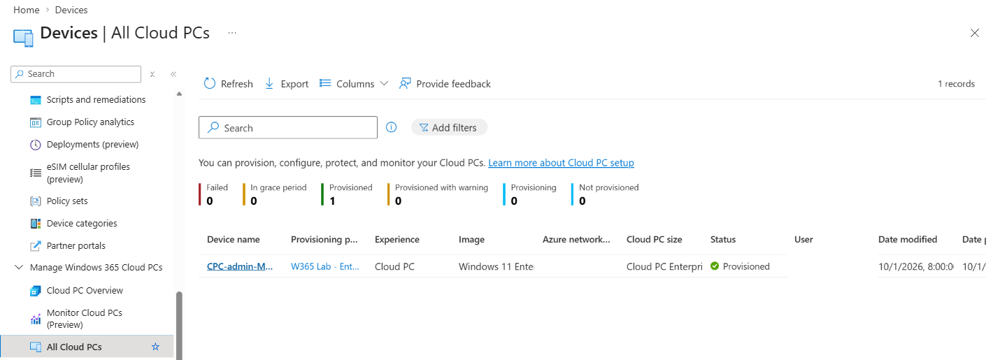<br><sub><b>All Cloud PCs:</b> one Cloud PC, status <b>Provisioned</b>. The user name is redacted.</sub></p>

#### Step 7: Check that the Cloud PC is compliant

**Why:** the Conditional Access rule (Step 9) only lets in **compliant** devices. If the Cloud PC isn't compliant, workers are blocked inside the Cloud PC too.

1. Go to the **Intune admin center** → **Devices** → **All devices**.
2. Find the Cloud PC (its name starts with `CPC-`). Check that **Managed by** is **Intune**, **Ownership** is **Corporate** and **Compliance** is **Compliant**.
3. If you use compliance policies (for example, ones that require particular security settings), make sure Cloud PCs can meet them. If they can't, give Cloud PCs their own compliance policy.

<p align="center">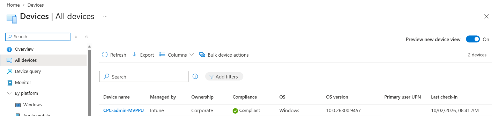<br><sub>The Cloud PC is <b>Intune</b>-managed, <b>Corporate</b> and <b>Compliant</b>. The user name is redacted.</sub></p>

### Part 3: Lock down the Cloud PCs

#### Step 8: Turn off copy and paste, file transfer and printing

**Why:** redirection features are how data could leave the Cloud PC and reach the laptop: copying text, moving files through a mapped drive, or printing to the laptop's printer. Windows 365 already turns most of them off by default. This policy makes that explicit, shows it in reports, and stops anyone from turning them back on.

1. Go to the **Intune admin center** → **Devices** → **Configuration** → **Create** → **New Policy**.

<p align="center">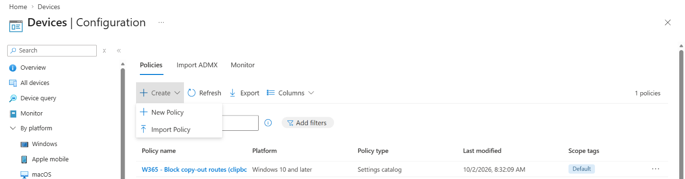<br><sub><b>Devices → Configuration → Create → New Policy.</b></sub></p>

2. Set **Platform** to **Windows 10 and later** and **Profile type** to **Settings catalog**, then select **Create**.

<p align="center">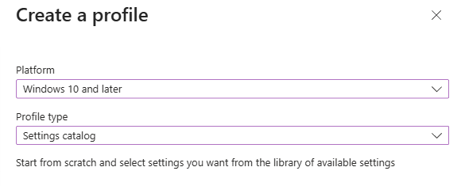<br><sub>The <b>Settings catalog</b> lets you search for individual settings.</sub></p>

3. On **Basics**, enter a name such as `W365 - Block copy-out routes` and a short description, then select **Next**.

<p align="center">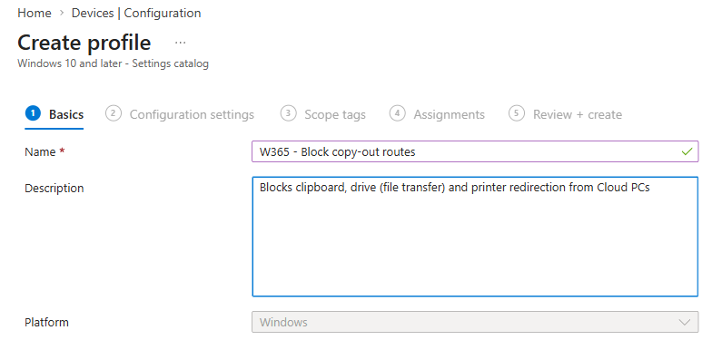</p>

4. On **Configuration settings**, select **+ Add settings**.

<p align="center">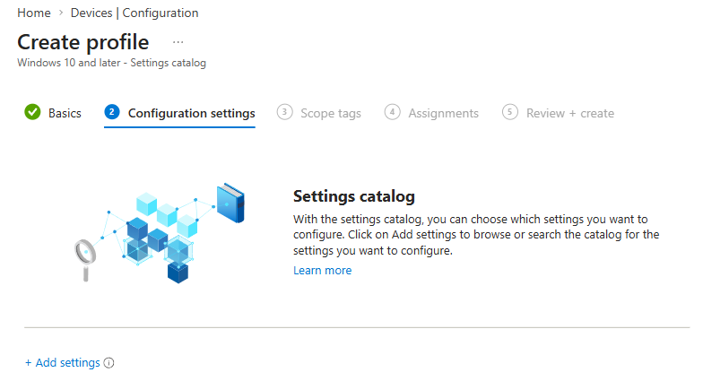</p>

5. In the **Settings picker**, search for `redirection`. Then:
   - Select the category **Administrative Templates > Windows Components > Remote Desktop Services > Remote Desktop Session Host > Device and Resource Redirection**, and tick **Do not allow Clipboard redirection** and **Do not allow drive redirection**. Optionally, also tick **Do not allow supported Plug and Play device redirection**, which blocks USB devices such as phones and cameras.
   - Select the neighbouring category **…Remote Desktop Session Host > Printer Redirection**, and tick **Do not allow client printer redirection**.
   - Close the picker.

<p align="center">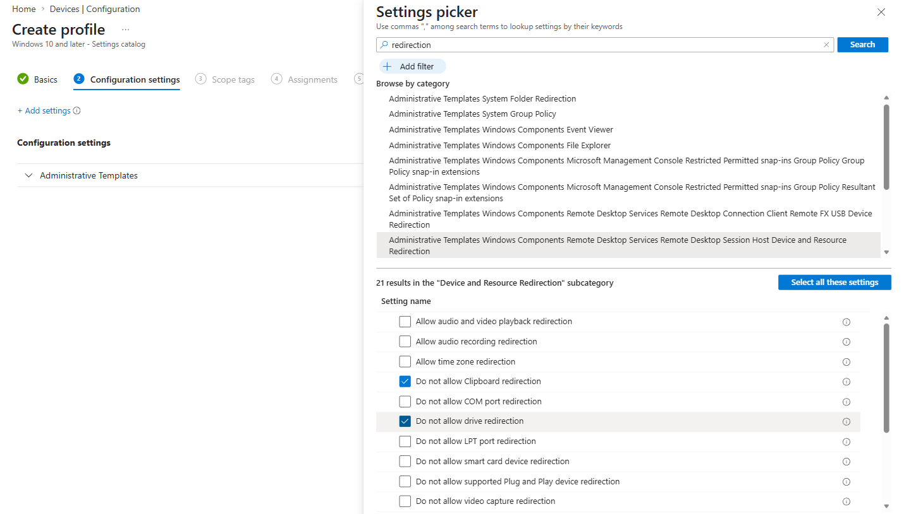<br><sub>The <b>Device and Resource Redirection</b> category, with clipboard and drive redirection selected. The printer setting is in the <b>Printer Redirection</b> category.</sub></p>

6. Set each setting to **Enabled**, then select **Next**. The settings are worded as "Do not allow…", so **Enabled** means the feature is **blocked**.

<p align="center">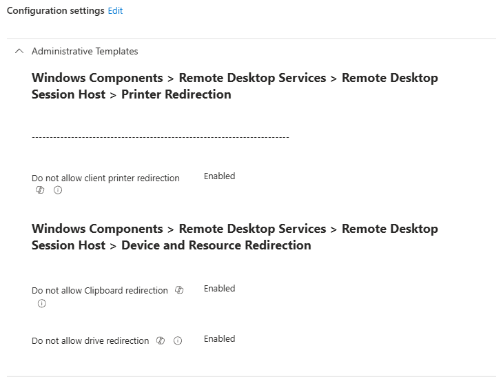<br><sub>All three settings are <b>Enabled</b>, so printing, copy and paste, and file transfer to the laptop are blocked.</sub></p>

7. On **Scope tags**, select **Next**. On **Assignments**, select **Add groups**, choose **W365 Cloud PC Users**, and select **Next**. Then select **Create**.
8. The Cloud PC picks up the policy the next time it checks in with Intune. To speed this up, open the Cloud PC under **Devices → All devices** and select **Sync**. When it's applied, the policy shows **Succeeded**.

<p align="center">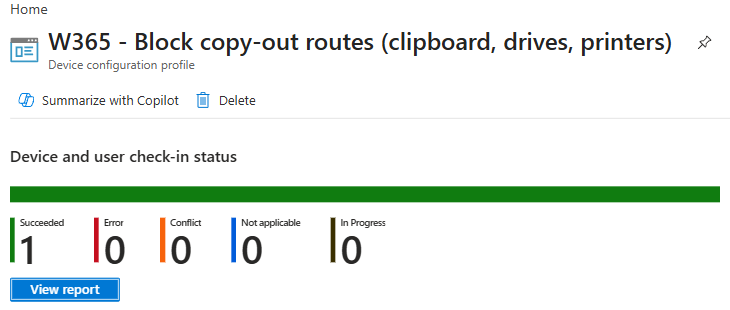<br><sub>The policy has reached the Cloud PC: <b>1 Succeeded</b>.</sub></p>

### Part 4: Block every other device

#### Step 9: Create the Conditional Access rule (in report-only mode)

**Why:** without this rule, a worker could skip the Cloud PC and open `outlook.office.com` directly on the client laptop. The rule only allows Microsoft 365 sign-ins from **compliant** (or, optionally, hybrid-joined) devices. The Cloud PC passes. The client laptop and personal devices don't.

Go to the **Entra admin center** → **Entra ID** → **Conditional Access** → **Policies** → **New policy**, and name it `Managed devices only - Cloud PC connection allowed`.

**a. Who the rule applies to: Users, Include tab.** Choose **Select users and groups**, tick **Users and groups**, search for the group, select it, and select **Select**.

<table>
<tr><th width="40%">Include the worker group</th><th width="60%">Pick the group in the search pane</th></tr>
<tr>
<td valign="top" align="center">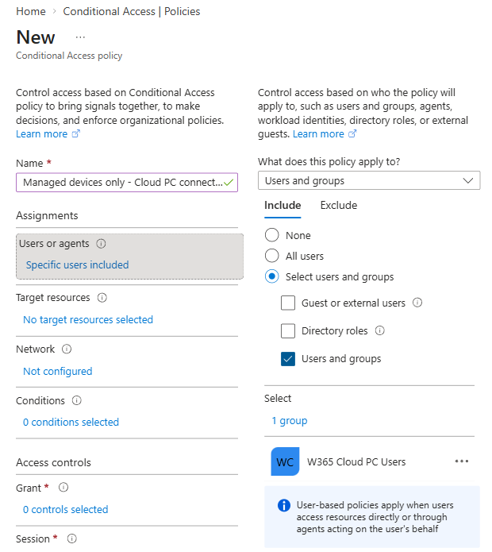</td>
<td valign="top" align="center">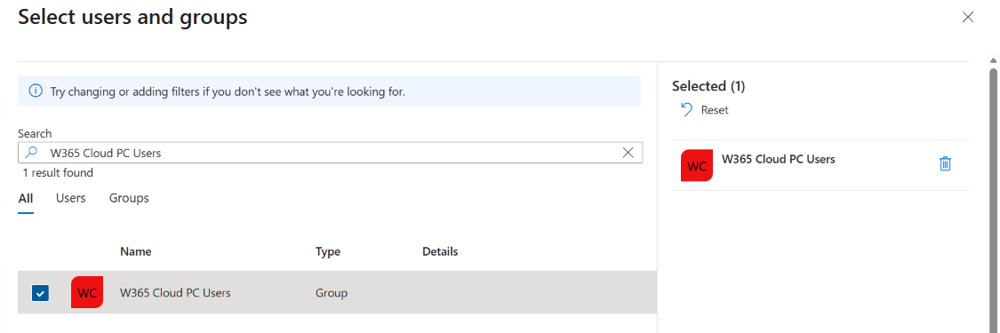</td>
</tr>
</table>

**b. Who to leave out: Users, Exclude tab.** Tick **Guest or external users** and choose all guest types. Their devices aren't managed by you, and they aren't the workers this rule is for. Also tick **Users and groups** and add your **emergency access account**.

<p align="center">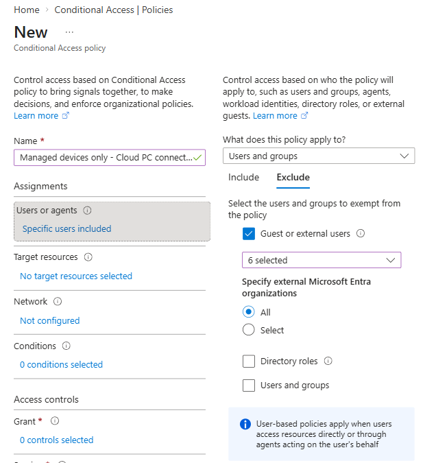<br><sub>Guests and external users are excluded. Add your emergency access account here too.</sub></p>

**c. Which apps: Target resources, Include tab.** Choose **All resources (formerly 'All cloud apps')**. The *Don't lock yourself out* warning is expected; it's why the rule only covers the worker group.

<p align="center">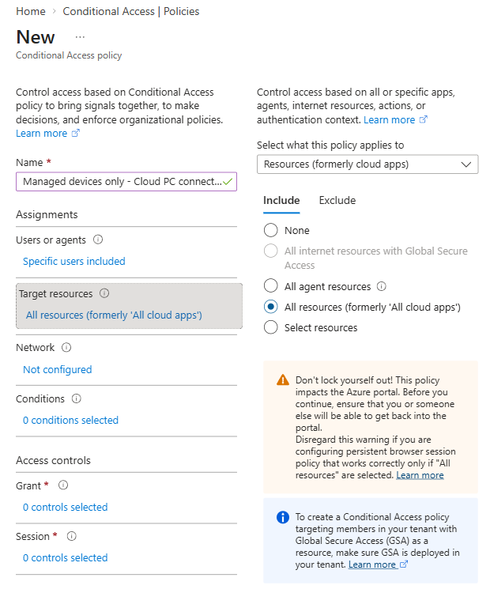<br><sub>The rule covers all of your Microsoft 365 apps.</sub></p>

**d. The Cloud PC connection apps: Target resources, Exclude tab.** Choose **Select resources**, select **None** under *Select specific resources*, then search for and tick **Windows 365**, **Azure Virtual Desktop** and **Windows Cloud Login**. If **Microsoft Remote Desktop** appears in your tenant, tick it too. Then select **Select**.

**Why:** these are the apps the client laptop uses to *reach* the Cloud PC. If the rule blocked them, workers couldn't connect to the Cloud PC at all. Excluding them doesn't open up your data, because Outlook, OneDrive and the other apps are still blocked on the laptop.

<p align="center">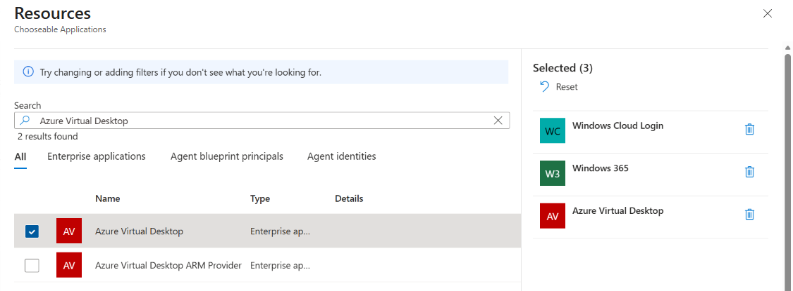<br><sub>Pick the three connection apps. App IDs are hidden in this screenshot.</sub></p>

<p align="center">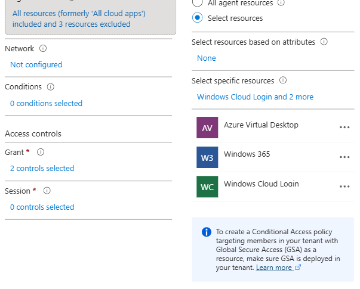<br><sub>The result: all resources are included, and the three connection apps are excluded.</sub></p>

**e. What the device must be: Grant.** Choose **Grant access**, then tick **Require device to be marked as compliant** and **Require Microsoft Entra hybrid joined device**. Under *For multiple controls*, choose **Require one of the selected controls**, then select **Select**. The hybrid-joined option lets in your own office PCs that are joined to your on-premises domain. If you don't have any, *compliant* on its own is enough.

<table>
<tr><th width="50%">Top of the Grant pane</th><th width="50%">Bottom of the Grant pane</th></tr>
<tr>
<td valign="top" align="center">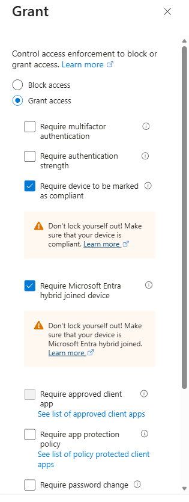</td>
<td valign="top" align="center">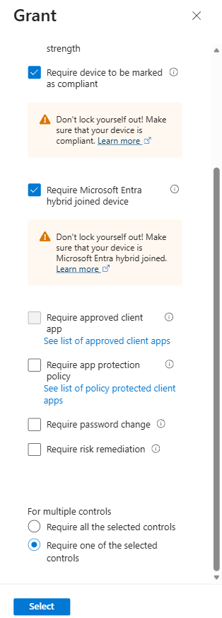</td>
</tr>
</table>

**f. Turn it on in report-only mode.** Under **Enable policy**, choose **Report-only**. The portal then asks about **macOS, iOS, Android and Linux**. Choose **Proceed with selected configuration**, then select **Create**.

> [!WARNING]
> Don't accept the other choice, *Exclude device platforms macOS, iOS, Android, and Linux*. It permanently removes those platforms from the rule. When you later turn the rule on, a personal Mac, iPhone or Android phone would still get into Microsoft 365. Choosing **Proceed** only means those devices may see a certificate prompt while the rule is in report-only mode.

<p align="center">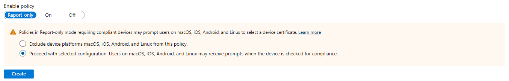<br><sub>Report-only, with <b>Proceed with selected configuration</b> chosen.</sub></p>

### Part 5: Test and turn it on

#### Step 10: Connect as a worker

Do this on the client laptop, or on any test device that your Intune doesn't manage.

1. Open [windows.cloud.microsoft](https://windows.cloud.microsoft) in a browser, or install the Windows App. Sign in as the **test user**. The Cloud PC appears under **Devices**. Select it.
2. The **In Session Settings** window opens. These tick boxes are only the *laptop's* preferences. The Intune policy from Step 8 still blocks clipboard, file transfer and printing, even if they're ticked here. Select **Connect**.

<p align="center">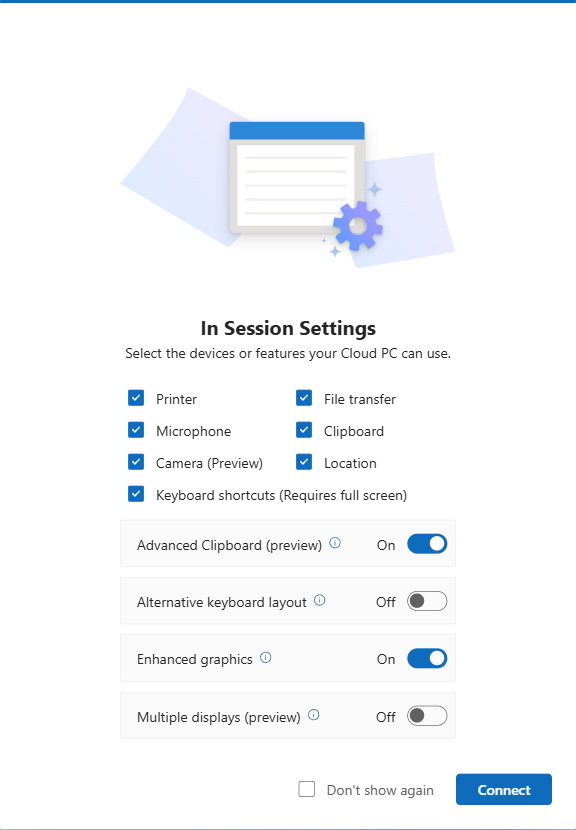<br><sub>The laptop's local preferences. The Cloud PC's Intune policy overrides them.</sub></p>

3. If you're asked to allow a remote desktop connection, select **Yes**. This is the single sign-on you turned on in Step 5. The Cloud PC desktop opens in the browser tab.

<p align="center">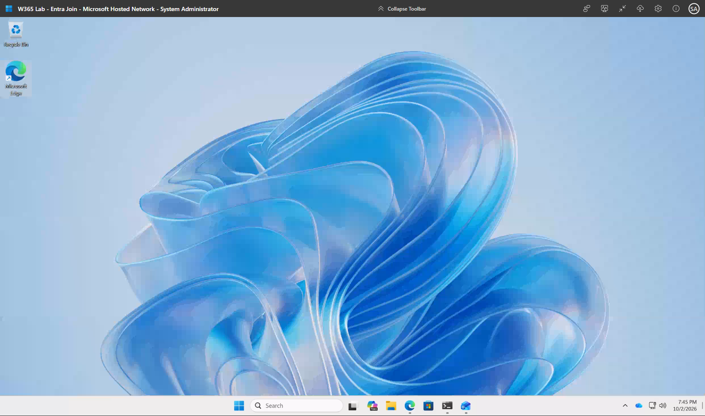<br><sub>The Cloud PC desktop. The bar at the top shows the provisioning policy's name (the lab used a different policy name from the one in Step 5).</sub></p>

4. Inside the Cloud PC, open Outlook, Teams and OneDrive. They should work normally.

#### Step 11: Check what the rule would do (report-only)

1. Go to the **Entra admin center** → **Conditional Access** → **Sign-in logs** (under *Monitoring*).
2. Open one of the test user's sign-ins and select the **Report-only** tab.
3. Expect **Report-only: Failure** for sign-ins made directly from the laptop (Outlook on the web, OneDrive), and **Report-only: Success** for sign-ins made inside the Cloud PC. The Windows App connection itself shows **Not applied**, because those apps are excluded.
4. Optionally, use the Conditional Access **What If** tool to try other users and devices.

#### Step 12: Turn the rule on, then roll out

1. With only the test user in the group, open the rule, set **Enable policy** to **On**, and save.
2. Run these tests:

| Test | Expected result |
|---|---|
| Laptop → Outlook on the web (`outlook.office.com`) | **Blocked** with error 53000 |
| Laptop → OneDrive or SharePoint in the browser | **Blocked** with error 53000 |
| Laptop → Windows App → Cloud PC | **Connects** |
| Inside the Cloud PC → Outlook, Teams, OneDrive | **Work normally** |
| Copy text in the Cloud PC and paste it on the laptop | **Nothing is pasted.** No laptop drives or printers appear inside the Cloud PC. |

<p align="center"><br><sub>What the worker sees on the laptop: <i>You can't get there from here</i>, error 53000, device state <i>Unregistered</i>.</sub></p>

3. Add workers to **W365 Cloud PC Users** in small waves. Each person added automatically gets a licence, a Cloud PC, the lockdown policy and the rule.
4. Tell workers: *"Go to windows.cloud.microsoft and do all your Contoso work inside the Cloud PC."*
5. Tell your service desk that error 53000 on a client laptop is **expected**. The fix is to use the Cloud PC.

> [!CAUTION]
> **If something goes wrong,** set the rule back to **Report-only** or **Off**, or remove the user from the group. If an administrator is locked out, sign in with the emergency access account and do the same.

## Option B: step by step

Use Option B only for workers who can't have a Cloud PC. It's weaker: Contoso data is still *displayed* on the client laptop, and only downloads are blocked.

**How it works:** three Conditional Access rules and one Defender for Cloud Apps policy work together.

| Rule | What it does | Why it's needed |
|---|---|---|
| **Site rule:** *Require a managed device, except at the client site* | Blocks sign-ins from unmanaged devices, unless the sign-in comes from the client office's network | Keeps personal devices, and anyone working off-site, out |
| **Apps rule:** *Desktop and mobile apps need a managed device* | Blocks the Outlook, Teams and OneDrive *apps* on unmanaged devices, while still allowing the browser | Apps can sync files to the laptop's disk, but the browser can be controlled |
| **Browser rule:** *Send browser sessions to Defender for Cloud Apps* | Routes browser sessions through Defender for Cloud Apps | So that the session policy can block downloads |
| **Session policy** (in Defender for Cloud Apps) | Replaces downloaded files with a "blocked" notice on devices that aren't compliant | It's what actually stops the files reaching the laptop |

**What you need on top of the [prerequisites](#what-you-need):** a Defender for Cloud Apps licence (included in Microsoft 365 E5 and E5 Security); the client's public IP address ranges; and ideally the client's agreement to let workers add a Contoso work profile in Microsoft Edge, which gives the smoothest experience.

### B1: Create a separate group

Create a security group such as `Client-Site Workers (browser)`, as in [Step 3](#step-3-create-a-group-for-the-workers), and add only the test user. Keep Option A and Option B workers in **different** groups. The site rule doesn't leave out the Cloud PC connection apps, so it would block Option A workers from reaching their Cloud PC.

### B2: Add the client site as a named location

Go to the **Entra admin center** → **Conditional Access** → **Named locations** → **IP ranges location**. Name it `Client site` and enter the client's public IP ranges. The site rule depends on these addresses, so check them with the client's IT team before you turn the rule on.

### B3: Create the three rules in report-only mode

Create each rule as you did in [Step 9](#step-9-create-the-conditional-access-rule-in-report-only-mode), with these settings:

- **Users:** include the Option B group; exclude guests and your emergency access account.
- **Target resources:** All resources.
- **Enable policy:** Report-only.

| Rule | Conditions | Grant or session |
|---|---|---|
| Site rule | **Network:** include *Any network or location*, exclude `Client site` | **Grant:** compliant *or* hybrid joined (require one) |
| Apps rule | **Client apps:** *Mobile apps and desktop clients* | **Grant:** compliant *or* hybrid joined (require one) |
| Browser rule | **Client apps:** *Browser* | **Session:** *Use Conditional Access App Control* → **Use custom policy** |

### B4: Create the session policy

Go to the **Defender portal** ([security.microsoft.com](https://security.microsoft.com)) → **Cloud apps** → **Policies** → **Policy management** → **Conditional access** tab → **Create policy** → **Session policy**.

| Setting | Value |
|---|---|
| Name | `Block download on unmanaged devices` |
| Session control type | **Control file download (with inspection)** |
| Activity filter | **Device** → **Tag** → **does not equal** → *Intune compliant*, *Microsoft Entra hybrid joined* |
| Action | **Block** (you can customise the message) |

<p align="center">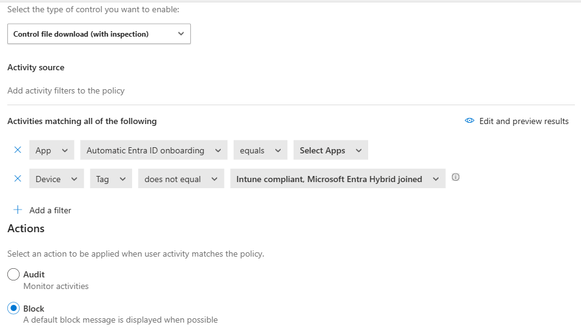<br><sub>The session policy blocks downloads on any device that isn't compliant or hybrid joined.</sub></p>

Create session policies in the Defender portal. The browser rule's **Use custom policy** setting is what connects the rule to them.

### B5: Check the site and apps rules in report-only mode

Use the sign-in logs' **Report-only** tab, as in [Step 11](#step-11-check-what-the-rule-would-do-report-only). Expect *Failure* for desktop apps on an unmanaged device, and for browser access from outside the client site.

### B6: Pilot the browser rule and the session policy

Report-only mode can't test session controls, so turn the **browser rule** **On** for the test user only. It can't block a sign-in on its own; it only routes the session. Then, on an unmanaged laptop:

1. Open OneDrive. Expect a "monitored" notice, or a prompt to switch to a work profile.
2. Select **Continue with current profile**. OneDrive opens through the proxy address (`…sharepoint.com.mcas.ms`).
3. Download a file. Instead of the file, you get a small notice file named `Blocked_<timestamp>.txt`.
4. In the **Defender portal**, go to **Cloud apps** → **Activity log**. The **Download file** entry shows a block icon.

<table>
<tr><th width="45%">The worker is asked to switch profile</th><th width="55%">The blocked download in the activity log</th></tr>
<tr>
<td valign="top" align="center">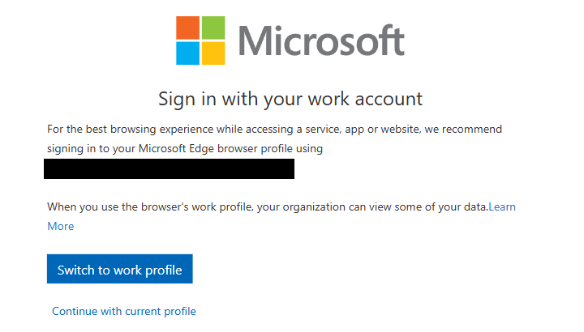<br><sub>The account name is redacted.</sub></td>
<td valign="top" align="center">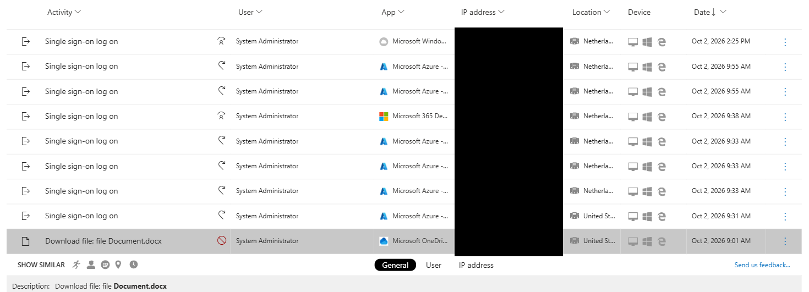<br><sub>IP addresses are redacted.</sub></td>
</tr>
</table>

### B7: Pilot the site and apps rules, then roll out

Turn the site and apps rules **On** for the test user. Check that the desktop apps are blocked and that the browser works only from the client site. Then add workers in waves, and warn them about the Edge work-profile prompt.

### A lighter alternative without Defender for Cloud Apps

*This wasn't tested in the lab.* Instead of the browser rule and the session policy, you can:

- Go to the **SharePoint admin center** → **Policies** → **Access control** → **Unmanaged devices**, and choose *Allow limited, web-only access*.
- For Exchange Online, set the Outlook on the web mailbox policy's `ConditionalAccessPolicy` to `ReadOnly` (or `ReadOnlyPlusAttachmentsBlocked`), and add a Conditional Access rule for Exchange Online that uses *app enforced restrictions*.

Users can then view files in the browser but can't download, print or sync them. There's no proxy page, and you don't need a Defender for Cloud Apps licence.

## Lab results

**How we tested:** we used a lab tenant with one Windows 365 Enterprise Cloud PC (2 vCPU, 8 GB RAM, 128 GB storage), Microsoft Entra join, the Microsoft-hosted network and the Windows 11 Enterprise + Microsoft 365 Apps image. The client laptop was a Windows device that wasn't registered in the lab tenant. Each rule was enforced for a test account only, while everything else stayed in report-only mode.

**Option A results:**

| Test | Result |
|---|---|
| Laptop → Outlook on the web | **Blocked** with error 53000, device state *Unregistered* |
| Laptop → OneDrive and SharePoint | **Blocked** with error 53000 |
| Laptop → Windows App → Cloud PC | **Connected** |
| Outlook inside the Cloud PC | **Opened normally** |
| `windows365.microsoft.com` from the laptop | **Works**, because it redirects to the Windows App |
| Clipboard, drive and printer redirection | **Already off** by Windows 365 default, and now enforced by Intune |

The Entra sign-in logs recorded the rule as a **failure** for every direct sign-in from the laptop and a **success** for sign-ins from the Cloud PC.

<p align="center"><br><sub>A check inside the Cloud PC: clipboard (<code>fDisableClip</code>), drive (<code>fDisableCdm</code>), printer (<code>fDisableCpm</code>) and plug-and-play (<code>fDisablePNPRedir</code>) redirection are all set to <code>1</code> (blocked), and no laptop drives or printers appear. The red text is a harmless formatting error in the query.</sub></p>

**Option B results.** The browser rule and the session policy were enforced. The site and apps rules were read from the sign-in logs in report-only mode.

| Device | Access type | Site rule | Apps rule | Browser rule |
|---|---|---|---|---|
| Laptop (unregistered) | Browser (Outlook, SharePoint) | Would block | Doesn't apply | Session routed to Defender for Cloud Apps |
| Laptop (unregistered) | Desktop apps | Would block | Would block | Doesn't apply |
| Cloud PC (compliant) | Browser and desktop apps | Allowed | Allowed | Session control, but no proxy |

Both download attempts from the unmanaged laptop were replaced by a block notice. On a compliant device with an Edge work profile (the Cloud PC), the same policy didn't send the session through the proxy.

## Good to know

- **Someone can still photograph the screen** with either option. Windows 365 [watermarking](https://learn.microsoft.com/en-us/windows-365/enterprise/watermarking) and [screen capture protection](https://learn.microsoft.com/en-us/azure/virtual-desktop/screen-capture-protection) reduce that risk, but don't remove it.
- **Option B's download control is a deterrent, not a hard wall.** In the lab, a scripted request made inside the browser session still returned the file. Pair it with sensitivity labels and auditing.
- **Report-only mode shows grant results, but it can't test session controls.** That's why Option B's browser rule is piloted with a test user.
- **The Windows 365 Portal app can't be targeted by Conditional Access.** If you try to exclude it, you get the error `UnsupportedFirstPartyApplication`. It doesn't need an exclusion, because the portal redirects to the Windows App.
- **The In Session Settings window in the Windows App** shows only the laptop's preferences, not what the Cloud PC allows.
- **Undo test changes straight away, and check that they're undone.**

## Troubleshooting

| Symptom | Likely cause and fix |
|---|---|
| The Cloud PC status is **Failed** | Usually a missing licence, or Windows (MDM) enrollment is blocked. See [Step 1](#step-1-check-your-licences) and [Step 2](#step-2-check-that-intune-allows-windows-devices). |
| Error 53000 **inside** the Cloud PC | The Cloud PC isn't compliant. Check **Devices → All devices → Compliance**, and the compliance policies assigned to it ([Step 7](#step-7-check-that-the-cloud-pc-is-compliant)). |
| The worker can't connect to the Cloud PC from the laptop | A connection app isn't excluded from the rule. Exclude **Windows 365**, **Azure Virtual Desktop** and **Windows Cloud Login** (and Microsoft Remote Desktop, if it's listed). |
| `UnsupportedFirstPartyApplication` when saving the rule | You tried to exclude the Windows 365 Portal app. Remove it; it isn't needed. |
| Personal Macs or phones still get in after the rule is turned on | The rule was created with *Exclude device platforms macOS, iOS, Android, and Linux*. Check **Conditions → Device platforms** in the rule and remove the exclusion. |
| Copy and paste still works | The Intune policy hasn't reached the Cloud PC yet. Select **Sync** on the device, and check the policy's status. |
| An administrator is locked out | Sign in with the emergency access account and set the rule to Report-only or Off. |
| Option B sessions always go to `*.mcas.ms` | The worker isn't using a Contoso work profile in Edge. That's the expected fallback. |
| Option B's session policy never triggers | The browser rule must be **On** (not report-only) and set to **Use custom policy**. |

## Roll back

1. Set the Conditional Access rule (or Option B's three rules) to **Report-only** or **Off**.
2. Remove users from the worker group.
3. If needed, unassign or delete the Intune lockdown policy (the Windows 365 defaults still apply) and the provisioning policy. Cloud PCs are removed when a user loses their licence or the provisioning policy assignment, after a grace period.

## Repository layout

```text
Client-Owned-Device-Access/
├── README.md        This guide
└── docs/
    └── images/      Diagrams and redacted lab screenshots
```

The screenshots come from a lab tenant, with names and identifiers redacted. *Contoso* is a placeholder company name.

## References

- [Windows 365 requirements](https://learn.microsoft.com/en-us/windows-365/enterprise/requirements)
- [Network requirements for Windows 365](https://learn.microsoft.com/en-us/windows-365/enterprise/requirements-network)
- [Create provisioning policies for Windows 365](https://learn.microsoft.com/en-us/windows-365/enterprise/create-provisioning-policy)
- [Set Conditional Access policies for Windows 365](https://learn.microsoft.com/en-us/windows-365/enterprise/set-conditional-access-policies)
- [Manage device RDP redirections for Cloud PCs](https://learn.microsoft.com/en-us/windows-365/enterprise/manage-rdp-device-redirections)
- [Intune enrollment restrictions](https://learn.microsoft.com/en-us/intune/intune-service/enrollment/enrollment-restrictions-set)
- [Assign licences to a group](https://learn.microsoft.com/en-us/entra/identity/users/licensing-groups-assign)
- [Conditional Access report-only mode](https://learn.microsoft.com/en-us/entra/identity/conditional-access/concept-conditional-access-report-only)
- [Manage emergency access accounts](https://learn.microsoft.com/en-us/entra/identity/role-based-access-control/security-emergency-access)
- [Named locations (network conditions)](https://learn.microsoft.com/en-us/entra/identity/conditional-access/location-condition)
- [Create session policies in Defender for Cloud Apps](https://learn.microsoft.com/en-us/defender-cloud-apps/session-policy-aad)
- [Control access from unmanaged devices in SharePoint](https://learn.microsoft.com/en-us/sharepoint/control-access-from-unmanaged-devices)

---

**Developer**: Dr Muataz Awad
