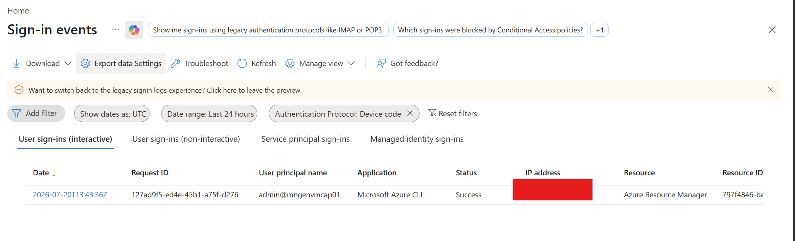
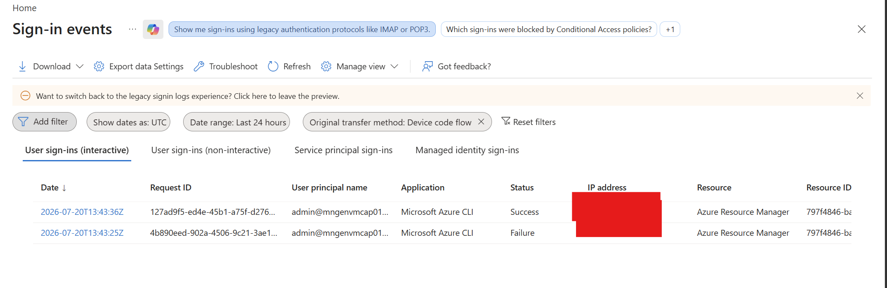
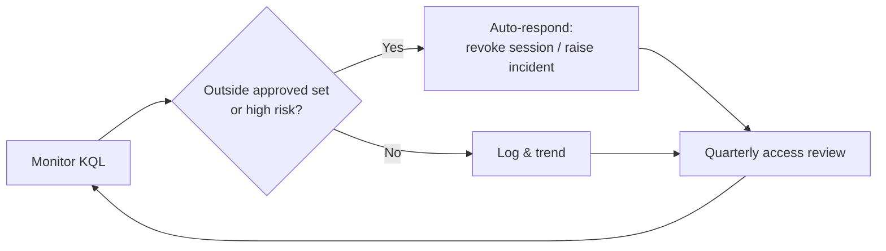

# Device Code Flow — Phishing Defense Playbook

A repeatable, low-risk process to discover, understand, and safely block **OAuth 2.0 Device Code Flow** abuse in Microsoft Entra ID — without breaking legitimate operational workflows.

**Developer**: Dr Muataz Awad

---

## Why this matters

Device Code Flow is designed for input-constrained devices (smart TVs, CLI tools, IoT). Attackers abuse it in phishing campaigns: they generate a device code, send the victim a legitimate-looking Microsoft prompt, and the victim unknowingly authorizes the attacker's session — often sailing past password + basic MFA because the victim completes the interactive part.

The safest way to remove this attack surface is to **block Device Code Flow with Conditional Access**, but only after you understand who legitimately depends on it. This playbook gets you there in a controlled way.

---

## How the attack works

The diagram below contrasts the **legitimate** Device Code Flow with how attackers **abuse** it — and why MFA alone doesn't stop it.

![Microsoft Entra ID Device Code Flow vs. Device Code Phishing. Top: the legitimate flow — a device requests a code, the user signs in on a second device, completes MFA or passkey, and Entra ID issues access and refresh tokens to the original device. Bottom: the phishing attack — the attacker requests a code, sends it to the victim via an urgent lure, the victim authenticates on the real Microsoft site and completes MFA, and Entra ID issues the tokens to the attacker's session. A six-step "How to protect" playbook runs across the footer.](Images/3.png)

**The key insight:** the victim uses the real Microsoft URL, enters real credentials, and completes real MFA or passkey — but because the *attacker* initiated the flow, the access and refresh tokens are issued to the **attacker's** session. This is why "just add MFA" does not stop device code phishing. The control that does is **Conditional Access → Authentication Flows**, rolled out via the stages below.

---

## The maturity model

The six stages below take you from *no visibility* to *enforced and self-monitoring*. Hand this to your team and run it top to bottom.

![Device Code Flow — Phishing Defense Playbook. A six-stage left-to-right process: (1) Discover — find every Device Code Flow sign-in using KQL or Entra sign-in logs; (2) Classify — separate business-required use from legacy or unknown; (3) Simulate — Report-only Conditional Access to measure impact before enforcing; (4) Exclude — create a minimal, documented exception group; (5) Enforce — switch the block policy from Report-only to On; (6) Monitor & Automate — continuously alert, auto-respond, and recertify. A dashed continuous-feedback loop returns from stage 6 back to stage 1.](Images/4.png)

Each stage exists to remove a specific risk — skip one and it reappears:

| Stage | Primary risk if skipped |
|---|---|
| Discover | Blind spots — you can't protect what you can't see |
| Classify | Blocking the business — legitimate use gets caught |
| Simulate | Outage on enforcement — surprises land in production |
| Exclude | Over-broad bypass — the exception becomes the hole |
| Enforce | Persistent attack surface — nothing actually changes |
| Monitor & Automate | Silent drift — the gap slowly re-opens |

The goal is not to block everything blindly — it's to block everything that *shouldn't* be used.

---

## 1. Discover

Goal: enumerate **every** Device Code Flow sign-in in your tenant. Use either path below — they return the same population.

### Option A — KQL (Sentinel / Log Analytics)

**Is there any device code sign-in? (count + first/last seen)**

```kusto
union isfuzzy=true SigninLogs, AADNonInteractiveUserSignInLogs
| where TimeGenerated >= ago(30d)
| where tostring(AuthenticationProtocol) =~ 'deviceCode'
| summarize DeviceCodeSignInCount=count(), FirstSeen=min(TimeGenerated), LastSeen=max(TimeGenerated)
```

**Full detail — who / what / where**

```kusto
union isfuzzy=true withsource=SourceTable SigninLogs, AADNonInteractiveUserSignInLogs
| where TimeGenerated >= ago(30d)
| where tostring(AuthenticationProtocol) =~ 'deviceCode'
| extend Loc = todynamic(column_ifexists('LocationDetails', dynamic({})))
| project
    TimeGenerated,
    SourceTable,
    UserPrincipalName,
    AppDisplayName,
    AppId,
    IPAddress,
    Country = tostring(Loc.countryOrRegion),
    City = tostring(Loc.city),
    ConditionalAccessStatus,
    ResultType,
    ResultDescription,
    RiskLevelAggregated,
    RiskState
| order by TimeGenerated desc
```

> Note: In Azure CLI, wrap the query in double quotes and use single quotes around `'deviceCode'`. In the Sentinel / Entra Logs blade, paste the raw KQL directly.

### Option B — Entra portal sign-in logs

Navigate to **Entra ID → Sign-in logs** and add a filter. The portal exposes **two equivalent filters** for device code — use whichever your tenant shows:

**Filter 1 — `Authentication Protocol: Device code`**



**Filter 2 — `Original transfer method: Device code flow`** (also surfaces failures)



Check all four tabs, because attackers and automation don't only live in the interactive tab:

- **User sign-ins (interactive)**
- **User sign-ins (non-interactive)**
- **Service principal sign-ins**
- **Managed identity sign-ins**

### What to capture for every result

| Attribute | Why you need it |
|---|---|
| User / UPN | Owner and blast radius |
| Application + App ID | What actually uses the flow |
| IP address + Country/City | Detect impossible / foreign origin |
| Status (Success/Failure) | Failures can indicate probing |
| Risk level / state | Correlate with Identity Protection |
| Conditional Access status | Is anything governing it today? |

---

## 2. Classify

For each result, decide whether it is:

- ✅ **Business required**, or
- ❌ **Legacy / unknown / unnecessary**

| Usage | Action |
|---|---|
| Teams Room / conference device | ✅ Likely keep |
| Azure CLI admin workflow | ⚠️ Evaluate — can it use interactive/browser auth instead? |
| Unknown user from unusual location | 🔎 Investigate — treat as potential phishing |
| Old script nobody owns | ❌ Remove |

Output of this stage: a short list of **genuinely required** users + applications. Everything else is a candidate to block.

---

## 3. Simulate

Create a Conditional Access policy — but do **not** enforce it yet.

**Policy settings**

- **Conditions → Authentication Flows** = `Device Code Flow`
- **Grant** = `Block access`
- **Enable policy** = `Report-only`

**Then answer, using Report-only + the same KQL:**

- What would break?
- Who would be blocked?
- Are there missed dependencies (automation, service accounts, appliances)?

This is where most organizations discover that one or two operational teams still legitimately need Device Code Flow. That's expected — capture it, don't rush past it.

> Report-only writes results to the sign-in logs (`ConditionalAccessStatus`), so you can quantify impact before anyone is actually blocked.

---

## 4. Exclude

Create a **small, documented** exception group for the legitimate cases found in stages 2–3. Consider pairing it with **location-based** conditions (e.g., only trusted named locations).

**Goal**

- ✅ Few users
- ✅ Few applications
- ✅ Documented business justification (owner + expiry/review date)

**Avoid**

- ❌ The entire IT department
- ❌ All admins
- ❌ Large, catch-all security groups

The exclusion set is your ongoing attack surface — keep it as close to zero as the business allows.

---

## 5. Enforce

Flip the policy from Report-only to On:

```text
Report Only
    ↓
On
```

Then keep monitoring with the **same Discover KQL**. Post-enforcement you should see:

- Device Code sign-ins only from the excluded users/apps
- `Block` results in Conditional Access for everything else

---

## 6. Monitor & Automate (final step for large enterprises, e.g. T‑Mobile)

For a large customer, add a durable governance loop so the attack surface can't silently creep back:

- **Automated detection** — a Sentinel Analytics Rule / automation rule that alerts on any Device Code sign-in **outside** the approved exclusion set, or with elevated risk / foreign IP.
- **Automated response** — SOAR / Logic App playbook to revoke sessions, disable the user, or raise a SOC incident on suspicious device code activity.
- **Recertification** — quarterly Access Reviews on the exclusion group; anything not re-justified is removed automatically.
- **Drift control** — alert whenever a new app or user starts using Device Code Flow.
- **KPIs & dashboard** — track: # device code sign-ins, size of exclusion set, blocked attempts, mean time to review.



---

## Appendix — Suspicious-only detection query

Use this when you want alerts *only* on the risky subset rather than all device code sign-ins:

```kusto
union isfuzzy=true SigninLogs, AADNonInteractiveUserSignInLogs
| where TimeGenerated >= ago(1d)
| where tostring(AuthenticationProtocol) =~ 'deviceCode'
| extend Loc = todynamic(column_ifexists('LocationDetails', dynamic({})))
| extend Country = tostring(Loc.countryOrRegion)
| where RiskLevelAggregated in ('medium','high')
    or RiskState in ('atRisk','confirmedCompromised')
    or Country !in ('US')            // adjust to your expected countries
| project TimeGenerated, UserPrincipalName, AppDisplayName, IPAddress, Country,
          RiskLevelAggregated, RiskState, ResultType
| order by TimeGenerated desc
```

Tune the country allow-list and risk thresholds to your tenant before turning it into an alert rule.
